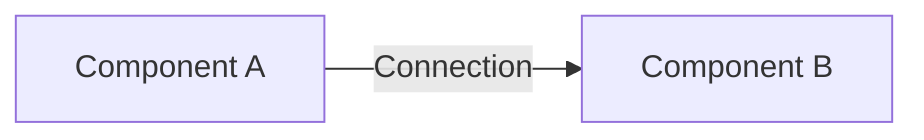

# Documentation Guide

## Overview

This guide describes how to maintain and contribute to the HomeLab documentation, including automation, standards, and best practices.

## Documentation Structure

```
docs/
├── DOCUMENTATION_GUIDE.md      # This file
├── architecture/               # Architecture documentation
│   ├── README.md              # Architecture overview
│   ├── 01-system-context.md   # C4: System context
│   ├── 02-container-architecture.md  # C4: Containers
│   ├── 04-deployment-architecture.md # Deployment topology
│   ├── 05-security-architecture.md   # Security controls
│   └── 06-data-architecture.md       # Data flows
├── adr/                       # Architecture Decision Records
│   ├── README.md
│   ├── template.md            # ADR template
│   ├── 0001-use-talos-linux.md
│   └── 0005-use-argocd-gitops.md
├── diagrams/                  # Architecture diagrams
│   ├── c4/                   # C4 model diagrams
│   ├── deployment/           # Deployment diagrams
│   └── network/              # Network topology
└── runbooks/                 # Operational procedures
    ├── bootstrap.md          # Bootstrap procedure
    └── troubleshooting.md    # Troubleshooting guide
```

## Documentation Standards

### Markdown Standards

- Use GitHub-flavored Markdown
- One sentence per line (for better Git diffs)
- Use heading anchors for internal links
- Include table of contents for long documents
- Use code blocks with language identifiers

**Example**:
```markdown
# Main Heading

## Section

This is a sentence on one line.
This is another sentence on a separate line.

```bash
# Code block with language
kubectl get pods
\`\`\`
```

### Diagram Standards

We use **Mermaid** for all diagrams (rendered by GitHub natively):



**Supported Diagram Types**:
- `graph` / `flowchart`: Flow diagrams
- `sequenceDiagram`: Sequence diagrams
- `classDiagram`: Class diagrams (future)
- `stateDiagram`: State machines (future)

**Diagram Guidelines**:
- Keep diagrams simple and focused
- Use consistent naming and styling
- Include legends when needed
- Use subgraphs for logical grouping

### Code Examples

- Always include working, tested examples
- Specify commands for both `make` targets and direct commands
- Include expected output when helpful
- Show error cases and solutions

**Example**:
```markdown
**Command**:
\`\`\`bash
make bootstrap
# Or manually:
terraform -chdir=./terraform apply -auto-approve
\`\`\`

**Expected output**:
\`\`\`
Apply complete! Resources: 15 added, 0 changed, 0 destroyed.
\`\`\`
```

### File Naming

- Use kebab-case: `my-document.md`
- ADRs: `NNNN-title.md` (e.g., `0001-use-talos-linux.md`)
- Runbooks: `action-name.md` (e.g., `bootstrap.md`, `disaster-recovery.md`)
- Architecture docs: `NN-topic.md` (e.g., `01-system-context.md`)

### Cross-References

Use relative links to reference other documents:

```markdown
See [Security Architecture](../architecture/05-security-architecture.md) for details.
```

## Contributing to Documentation

### When to Update Documentation

Update documentation when:
- Adding new infrastructure components
- Making architectural changes
- Adding new applications
- Changing deployment procedures
- Creating new operational procedures
- Fixing bugs in runbooks

### Documentation Checklist

Before committing documentation changes:

- [ ] Markdown linting passes (if using linter)
- [ ] All links work (internal and external)
- [ ] Diagrams render correctly on GitHub
- [ ] Code examples tested and working
- [ ] Spelling and grammar checked
- [ ] Related documents updated
- [ ] CHANGELOG updated (if applicable)

### Creating a New Architecture Document

1. Copy an existing document as a template
2. Follow the structure: Overview, Diagrams, Details, References
3. Include Mermaid diagrams
4. Link from main architecture README
5. Create PR for review

### Creating a New ADR

1. Copy the ADR template:
   ```bash
   cp docs/adr/template.md docs/adr/NNNN-your-decision.md
   ```

2. Fill in all sections:
   - Context: Why is this decision needed?
   - Decision: What was decided?
   - Consequences: What are the trade-offs?
   - Alternatives: What else was considered?

3. Add to ADR index in `docs/adr/README.md`

4. Commit with descriptive message:
   ```bash
   git add docs/adr/
   git commit -m "docs: add ADR for [decision]"
   ```

### Creating a New Runbook

1. Create file in `docs/runbooks/`
2. Follow structure:
   - Overview
   - Prerequisites
   - Procedure (step-by-step)
   - Troubleshooting
   - Related runbooks

3. Test the procedure!
4. Add to runbook index (if exists)

## Documentation Automation

### Mermaid Rendering

GitHub automatically renders Mermaid diagrams. No action needed.

**Preview locally**:
- Use VS Code with Mermaid extension
- Use Mermaid Live Editor: https://mermaid.live/

### Link Checking

**Manual link checking**:
```bash
# Install markdown-link-check
npm install -g markdown-link-check

# Check all docs
find docs/ -name "*.md" -exec markdown-link-check {} \;
```

**Future: GitHub Action**:
```yaml
# .github/workflows/docs.yml
name: Documentation
on: [push, pull_request]
jobs:
  links:
    runs-on: ubuntu-latest
    steps:
      - uses: actions/checkout@v3
      - uses: gaurav-nelson/github-action-markdown-link-check@v1
```

### Markdown Linting

**Optional: markdownlint**:
```bash
# Install
npm install -g markdownlint-cli

# Lint
markdownlint docs/

# Auto-fix
markdownlint --fix docs/
```

**Configuration** (`.markdownlint.json`):
```json
{
  "default": true,
  "MD013": false,
  "MD033": false,
  "MD041": false
}
```

### Diagram Validation

Mermaid diagrams are validated by GitHub rendering.

**Pre-commit validation** (future):
```bash
# Install mermaid-cli
npm install -g @mermaid-js/mermaid-cli

# Validate diagram
mmdc -i diagram.mmd -o diagram.png
```

## Documentation Maintenance

### Regular Reviews

**Monthly**:
- Review recent changes for documentation needs
- Check for broken links
- Update diagrams if architecture changed
- Verify runbooks still accurate

**Quarterly**:
- Full documentation audit
- Test all runbook procedures
- Update screenshots (if any)
- Review and update ADRs
- Archive outdated documents

### Keeping Docs in Sync with Code

**When to update docs**:
- Before merging infrastructure changes
- After adding new applications
- When deployment procedures change
- When troubleshooting discovers new patterns

**Workflow**:
1. Make code changes
2. Update relevant documentation
3. Create single PR with both code and docs
4. Review both together

### Documentation Debt

Track documentation TODOs:

```markdown
<!-- TODO: Add disaster recovery procedures -->
<!-- TODO: Create network diagram -->
<!-- TODO: Document backup strategy -->
```

**Future**: Create GitHub issues for documentation tasks

## Documentation Tools

### Recommended VS Code Extensions

- **Markdown All in One**: Enhanced markdown editing
- **Markdown Preview Mermaid**: Preview Mermaid diagrams
- **markdownlint**: Linting
- **Code Spell Checker**: Spell checking

### Recommended Tools

- **Mermaid Live Editor**: https://mermaid.live/ - Online diagram editor
- **Draw.io** (optional): For complex diagrams not suitable for Mermaid
- **PlantUML** (future): Alternative to Mermaid for C4 diagrams

### Documentation as Code

**Benefits**:
- Version controlled (Git)
- Review process (PRs)
- Searchable (grep, GitHub search)
- Always in sync with code (same repo)
- Collaborative (multiple contributors)

## Best Practices

### Writing Style

- **Be concise**: Short sentences, clear language
- **Be specific**: Use concrete examples
- **Be consistent**: Follow established patterns
- **Be helpful**: Include context and "why"
- **Be current**: Update when things change

### Diagram Tips

- **Keep it simple**: One concept per diagram
- **Use subgraphs**: Group related components
- **Label connections**: Show what flows between components
- **Use consistent names**: Match code and config
- **Provide context**: Explain what the diagram shows

### Code Example Tips

- **Test before committing**: All examples should work
- **Show the full command**: Include namespaces, flags
- **Include output**: Show expected results
- **Show errors**: Common mistakes and fixes
- **Provide alternatives**: `make` targets and manual commands

### Runbook Tips

- **Step-by-step**: Clear, numbered steps
- **Prerequisites**: List what's needed upfront
- **Verification**: How to verify each step succeeded
- **Troubleshooting**: Common issues and solutions
- **Recovery**: How to rollback or undo

## Documentation Metrics

Track documentation health:

- **Coverage**: % of components documented
- **Freshness**: Days since last update
- **Accuracy**: Issues found vs. resolved
- **Usage**: Page views, references

**Future: Documentation dashboard**

## Getting Help

### Questions About Documentation

- Check existing documentation first
- Search GitHub issues
- Ask in discussions (if enabled)
- Create issue with `documentation` label

### Suggesting Improvements

Create an issue or PR with:
- What's unclear or missing
- Suggested improvement
- Affected documents

## Roadmap

### Short Term (1-3 months)

- [ ] Add C4 Component diagrams
- [ ] Create disaster recovery runbook
- [ ] Add upgrade procedures runbook
- [ ] Document all applications individually

### Medium Term (3-6 months)

- [ ] Set up automated link checking (GitHub Action)
- [ ] Add architecture diagrams with PlantUML
- [ ] Create video walkthroughs (optional)
- [ ] Generate API documentation (if applicable)

### Long Term (6+ months)

- [ ] Documentation site (MkDocs or Docusaurus)
- [ ] Interactive diagrams (Structurizr)
- [ ] Automated diagram generation from code
- [ ] Documentation metrics dashboard

## Related Documents

- [Architecture README](architecture/README.md) - Architecture documentation index
- [ADR README](adr/README.md) - Decision records index
- [Bootstrap Runbook](runbooks/bootstrap.md) - Cluster bootstrap procedure

## References

- [Markdown Guide](https://www.markdownguide.org/)
- [Mermaid Documentation](https://mermaid.js.org/)
- [C4 Model](https://c4model.com/)
- [Architecture Decision Records](https://adr.github.io/)
- [Diátaxis Documentation Framework](https://diataxis.fr/)
