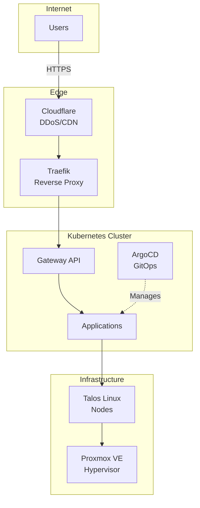

# HomeLab Documentation

Welcome to the HomeLab infrastructure documentation. This comprehensive guide covers architecture, operations, and decision-making for the Kubernetes-based HomeLab.

## Quick Navigation

### 🏗️ Architecture
- [System Context](architecture/01-system-context.md) - High-level system overview and boundaries
- [Container Architecture](architecture/02-container-architecture.md) - Service and deployment architecture
- [Deployment Architecture](architecture/04-deployment-architecture.md) - Infrastructure topology and deployment patterns
- [Security Architecture](architecture/05-security-architecture.md) - Security controls and boundaries
- [Data Architecture](architecture/06-data-architecture.md) - Data flows and storage strategies

### 📋 Operational Runbooks
- [Bootstrap](runbooks/bootstrap.md) - Complete cluster bootstrap procedure
- [Troubleshooting](runbooks/troubleshooting.md) - Common issues and solutions

### 📝 Architecture Decision Records (ADRs)
- [ADR Index](adr/README.md) - All architectural decisions
- [ADR 0001: Use Talos Linux](adr/0001-use-talos-linux.md)
- [ADR 0005: Use ArgoCD for GitOps](adr/0005-use-argocd-gitops.md)

### 📚 Guides
- [Documentation Guide](DOCUMENTATION_GUIDE.md) - How to contribute and maintain documentation

## Documentation Overview

### Architecture Documentation (C4 Model)

The architecture follows the [C4 Model](https://c4model.com/) for documenting software architecture:

1. **System Context** - How the HomeLab fits in the wider environment
2. **Container** - High-level technology choices and service architecture
3. **Component** - Internal structure of containers (future)
4. **Code** - Class diagrams and implementation details (future)

### Architecture Decision Records

All significant architectural decisions are documented as ADRs. Each ADR captures:
- The context and problem
- The decision made
- Consequences and trade-offs
- Alternatives considered

See [ADR README](adr/README.md) for the complete list and process.

### Runbooks

Step-by-step operational procedures for common tasks:
- **Bootstrap**: Complete cluster setup from scratch
- **Troubleshooting**: Diagnostic procedures and common fixes
- **Disaster Recovery**: (planned)
- **Upgrades**: (planned)

## Key Technologies

| Category | Technology | Documentation |
|----------|-----------|---------------|
| **Virtualization** | Proxmox VE | [Deployment Architecture](architecture/04-deployment-architecture.md) |
| **OS** | Talos Linux | [ADR 0001](adr/0001-use-talos-linux.md) |
| **Container Runtime** | containerd | [Deployment Architecture](architecture/04-deployment-architecture.md) |
| **CNI** | Cilium | [Container Architecture](architecture/02-container-architecture.md) |
| **Ingress** | Gateway API | [Container Architecture](architecture/02-container-architecture.md) |
| **GitOps** | ArgoCD | [ADR 0005](adr/0005-use-argocd-gitops.md) |
| **Certificates** | Cert-Manager | [Security Architecture](architecture/05-security-architecture.md) |
| **Secrets** | Sealed Secrets | [Security Architecture](architecture/05-security-architecture.md) |
| **Storage** | Proxmox CSI | [Data Architecture](architecture/06-data-architecture.md) |
| **Observability** | Grafana Cloud | [Container Architecture](architecture/02-container-architecture.md) |

## Getting Started

### For New Users

1. Read [System Context](architecture/01-system-context.md) for high-level overview
2. Review [Container Architecture](architecture/02-container-architecture.md) to understand services
3. Follow [Bootstrap Runbook](runbooks/bootstrap.md) to deploy

### For Operators

1. Bookmark [Troubleshooting Guide](runbooks/troubleshooting.md)
2. Review [Security Architecture](architecture/05-security-architecture.md)
3. Understand [Deployment Architecture](architecture/04-deployment-architecture.md)

### For Contributors

1. Read [Documentation Guide](DOCUMENTATION_GUIDE.md)
2. Review [ADR Process](adr/README.md)
3. Check [Architecture README](architecture/README.md)

## Quick Reference

### Essential Commands

```bash
# Bootstrap entire infrastructure
make bootstrap

# Get ArgoCD admin password
make argocd-password

# Restart services
make glance-restart
make isponsorblocktv-restart
make argocd-restart

# Terraform operations
make terraform-init
make terraform-plan
make terraform-apply

# Kubernetes access
kubectl get nodes
kubectl get pods -A
kubectl get applications -n argocd
```

### Essential URLs

- ArgoCD: https://argocd.ravil.space
- Grafana Cloud: (configured in Terraform)
- Proxmox: https://proxmox.local:8006

### File Locations

- Infrastructure code: `terraform/`
- Kubernetes manifests: `k8s/`
- Applications: `k8s/apps/`
- Infrastructure: `k8s/infra/`
- Documentation: `docs/`

## Architecture at a Glance



## Documentation Structure

```
docs/
├── README.md                    # This file - main documentation index
├── DOCUMENTATION_GUIDE.md       # How to contribute to documentation
├── architecture/                # Architecture documentation (C4 model)
│   ├── README.md
│   ├── 01-system-context.md
│   ├── 02-container-architecture.md
│   ├── 04-deployment-architecture.md
│   ├── 05-security-architecture.md
│   └── 06-data-architecture.md
├── adr/                        # Architecture Decision Records
│   ├── README.md
│   ├── template.md
│   ├── 0001-use-talos-linux.md
│   └── 0005-use-argocd-gitops.md
├── diagrams/                   # Standalone diagrams (future)
└── runbooks/                   # Operational procedures
    ├── bootstrap.md
    └── troubleshooting.md
```

## Contributing

See [Documentation Guide](DOCUMENTATION_GUIDE.md) for:
- Documentation standards
- How to create ADRs
- How to write runbooks
- Diagram conventions
- Automation tools

## Documentation Principles

1. **Documentation as Code**: All docs in Git, reviewed via PRs
2. **Always Up-to-Date**: Update docs with code changes
3. **Diagrams as Code**: Use Mermaid for diagrams (rendered by GitHub)
4. **Searchable**: Text-based, easily searchable
5. **Comprehensive**: Cover architecture, operations, and decisions
6. **Accessible**: Clear language, examples, step-by-step guides

## Support

- **Issues**: [GitHub Issues](../../issues) (if public repo)
- **Main README**: [Project README](../README.md)
- **CLAUDE.md**: [Command reference](../CLAUDE.md)

## Roadmap

### Completed ✅
- [x] System context documentation
- [x] Container architecture documentation
- [x] Deployment architecture documentation
- [x] Security architecture documentation
- [x] Data architecture documentation
- [x] ADR framework and initial ADRs
- [x] Bootstrap runbook
- [x] Troubleshooting guide
- [x] Documentation guide

### In Progress 🚧
- [ ] Component architecture diagrams
- [ ] Individual application documentation
- [ ] Disaster recovery runbook

### Planned 📅
- [ ] Upgrade procedures runbook
- [ ] Network topology diagrams
- [ ] Sequence diagrams for key flows
- [ ] Performance tuning guide
- [ ] Cost optimization guide
- [ ] Security hardening checklist

## Recent Updates

- **2025-01**: Initial comprehensive documentation created
  - Architecture documentation (C4 model)
  - ADR framework with initial decisions
  - Operational runbooks (bootstrap, troubleshooting)
  - Data architecture and flows
  - Security architecture

## License

This documentation is part of the HomeLab project. See main project LICENSE for details.

---

**Last Updated**: 2025-01-30

**Maintained By**: HomeLab Administrator

**Questions?** See [Documentation Guide](DOCUMENTATION_GUIDE.md) or create an issue.
