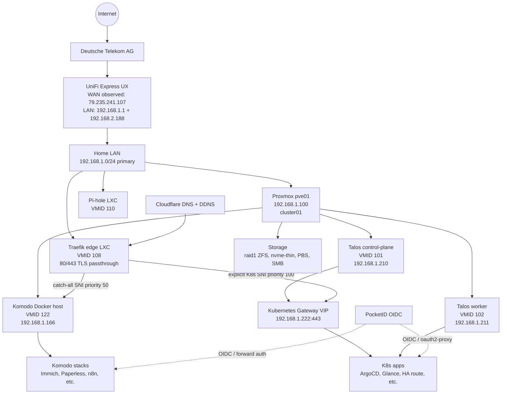

# Homelab Architecture Snapshot

This document is the current end-to-end view of Ravil's homelab: network edge, Proxmox, Kubernetes, Komodo/Docker, ingress, storage, observability, and operational flows.

It combines infrastructure-as-code from this repository with a point-in-time live discovery of UniFi, Proxmox, Kubernetes, and the Komodo Docker host.

## Snapshot metadata

- **Snapshot date:** 2026-06-14
- **Primary domain:** `ravil.space`
- **Home network:** UniFi-managed LAN behind a UniFi Express gateway
- **Virtualization:** Proxmox VE cluster `cluster01`
- **Kubernetes:** Talos Linux cluster on Proxmox VMs
- **Docker platform:** Komodo-managed Docker Compose host
- **IaC sources:** `terraform/`, `k8s/`, `komodo/stacks/`, `komodo/stacks.toml`
- **Live sources used:** UniFi API, Proxmox API, Kubernetes API, Docker on `komodo`

Exact IP addresses and service inventories below are operationally useful, but they are still a snapshot. Treat the repository as the source of truth for desired state and live APIs as the source of truth for current state.

## Topology diagram

- Standalone rendered diagram: [`../diagrams/network/homelab-network.html`](../diagrams/network/homelab-network.html)
- Mermaid source is included below for GitHub rendering.

## Network and edge

### UniFi gateway

- **Gateway:** UniFi Express (`UX`)
- **Hostname:** `UniFi-Express`
- **Firmware:** `4.0.15`
- **Network app:** `9.0.118`
- **ISP:** Deutsche Telekom AG
- **Timezone:** Europe/Berlin
- **WAN IP observed:** `79.235.241.107`
- **LAN IPs observed on gateway:** `192.168.1.1`, `192.168.2.188`
- **Configuration counts:**
  - LAN configurations: 3
  - WAN configurations: 1
  - Wi-Fi configurations: 4
  - Gateway devices: 1
  - Total UniFi devices: 1
- **Clients observed:**
  - Wi-Fi clients: 12
  - Wired clients: 8
  - Guest clients: 0
- **Health observed:**
  - WAN uptime: 100%
  - Offline devices: 0
  - Offline gateway/wired/Wi-Fi devices: 0
  - Critical notifications: 0
- **Threat inspection:** inspection off, IDS/IPS disabled

### LAN roles

- `192.168.1.1` — UniFi Express gateway
- `192.168.1.100` — Proxmox node `pve01`
- `192.168.1.166` — Komodo Docker host LXC
- `192.168.1.210` — Talos control-plane node observed from Kubernetes pods
- `192.168.1.211` — Talos worker node observed from Kubernetes pods
- `192.168.1.222` — Kubernetes Gateway API HTTPS target used by edge Traefik

### DNS and public access

The public namespace is `*.ravil.space`.

- Cloudflare DNS points public service names at the homelab edge.
- `cloudflare-ddns` runs in Kubernetes namespace `ddns` and keeps DNS aligned with WAN changes.
- Pi-hole exists as a Proxmox LXC for LAN DNS/ad-blocking.
- External HTTPS enters the homelab at the Traefik edge LXC.

## Ingress and TLS routing

There are two Traefik layers with different jobs.

### Edge Traefik LXC

- **Proxmox guest:** LXC `108`, name `traefik`
- **Role:** public edge, receives `80/tcp` and `443/tcp`
- **Terraform source:** `terraform/modules/traefik/`
- **Dynamic routing source:** `terraform/modules/traefik/configs/tcp_routers.yaml`
- **Mode:** TCP SNI routing with TLS passthrough

Routing policy:

- `k8s-tcp-router`
  - Priority: `100`
  - Target: `192.168.1.222:443`
  - Matches explicit Kubernetes-served hostnames.
- `komodo-tcp-router`
  - Priority: `50`
  - Target: `192.168.1.166:443`
  - Catch-all `HostSNI("*")` for Komodo/Docker services.

Kubernetes SNI hostnames currently routed explicitly:

- `argocd.ravil.space`
- `glance.ravil.space`
- `dozzle.k8s.ravil.space`
- `it-tools.ravil.space`
- `inbox-zero.ravil.space`
- `changedetection.ravil.space`
- `ha.ravil.space`
- `openwebui.ravil.space`
- `pocketid.ravil.space`
- `proxmox.ravil.space`

Operational rule:

- Add a new Kubernetes-served hostname to `tcp_routers.yaml`.
- Add a new Komodo-served hostname only to the stack labels; it will fall through to the Komodo catch-all.

### Komodo Traefik container

- **Host:** Komodo LXC `122`, `192.168.1.166`
- **Stack source:** `komodo/stacks/traefik/compose.yaml`
- **Role:** HTTP reverse proxy for Docker Compose stacks
- **TLS:** Cloudflare resolver configured in the stack
- **Auth:** OIDC forward-auth middleware backed by PocketID for protected public apps

### Kubernetes Gateway API

- **Gateway manifests:** `k8s/infra/network/gateway/`
- **Gateway target used by edge:** `192.168.1.222:443`
- **CNI/LB:** Cilium with Gateway API support
- **TLS:** cert-manager manages certificates; wildcard cert resources live under gateway manifests

## Proxmox platform

### Cluster

- **Cluster:** `cluster01`
- **Quorum:** yes
- **Node count:** 1
- **Node:** `pve01`
- **Node IP:** `192.168.1.100`
- **Node status:** online
- **Capacity observed:**
  - CPU: 6 cores
  - RAM: about 32 GiB

### Guests

Running VMs:

- `101` — `talos-cp-01`, Talos Kubernetes control-plane, Terraform-managed
- `102` — `talos-worker-01`, Talos Kubernetes worker, Terraform-managed
- `105` — `haos12.4`, Home Assistant OS

Running LXCs:

- `103` — `proxmox-backup-server`, backup service
- `104` — `pocketid`, identity provider instance
- `106` — `changedetection`, website change monitoring
- `108` — `traefik`, edge TLS-passthrough router
- `110` — `pihole`, LAN DNS/ad-blocking
- `112` — `prometheus-pve-exporter`, Proxmox metrics exporter
- `114` — `hermes`, Hermes Agent host/services
- `117` — `fileserver`, LAN file services
- `122` — `komodo`, Docker/Komodo host at `192.168.1.166`
- `125` — `vless-gateway`, sing-box/VLESS gateway

Stopped templates:

- `113` — `ubuntu`, LXC template

### Storage

- `raid1`
  - Type: ZFS pool
  - Capacity observed: about 11.85 TB
  - Content: VM images and container root filesystems
- `nvme-thin`
  - Type: LVM-thin
  - Capacity observed: about 980 GB
  - Content: VM images and container root filesystems
- `local`
  - Type: directory
  - Content: backups, templates, snippets, ISOs
- `local-lvm`
  - Type: LVM-thin
  - Content: VM images and container root filesystems
- `pbs-s3-blackbaze`
  - Type: Proxmox Backup Server storage
  - Content: backups
- `smb`
  - Type: CIFS
  - Capacity observed: about 1 TB
  - Content: backups and images

## Kubernetes platform

### Cluster shape

- **OS:** Talos Linux
- **Control plane:** `talos-cp-01`, observed at `192.168.1.210`
- **Worker:** `talos-worker-01`, observed at `192.168.1.211`
- **IaC source:** Terraform modules under `terraform/modules/talos/`
- **Manifests:** `k8s/`
- **GitOps:** ArgoCD

### Core infrastructure namespaces

- `argocd` — GitOps controller and UI
- `cert-manager` — certificate automation
- `cilium-secrets` and `kube-system` — Cilium/eBPF networking and Hubble
- `csi-proxmox` — Proxmox CSI controller and node plugin
- `ddns` — Cloudflare DDNS updater
- `gateway` — Gateway API resources
- `monitoring` — cluster monitoring components
- `sealed-secrets` — encrypted Kubernetes secrets controller

### Application namespaces

- `changedetection`
- `dozzle`
- `glance`
- `grafana`
- `haos`
- `inbox-zero`
- `isponsorblocktv`
- `it-tools`
- `openwebui`
- `pocketid`
- `proxmox`

### Kubernetes app inventory

Internal apps from `k8s/apps/internal/`:

- `glance.ravil.space` — personal dashboard
- `dozzle.k8s.ravil.space` — Kubernetes-side log viewer with oauth2-proxy
- `it-tools.ravil.space` — utility toolbox
- `inbox-zero.ravil.space` — email management
- `isponsorblocktv` — internal worker/service without public hostname in the edge SNI list

External services routed through Kubernetes from `k8s/apps/external/`:

- `changedetection.ravil.space` — routes to the Proxmox/LXC service
- `ha.ravil.space` — routes to Home Assistant OS
- `openwebui.ravil.space` — routes to Open WebUI
- `pocketid.ravil.space` — routes to PocketID
- `proxmox.ravil.space` — TLS passthrough route to Proxmox
- `grafana.ravil.space` — Grafana route; note that Docker `grafana-lgtm` also exposes this hostname in the Komodo stack, so confirm the active route through Traefik logs when changing it

## Komodo and Docker platform

### Host

- **Proxmox guest:** LXC `122`, name `komodo`
- **LAN IP:** `192.168.1.166`
- **Role:** Docker Compose stack host and Komodo control plane/periphery
- **Stack definitions:** `komodo/stacks/<stack>/compose.yaml`
- **Komodo inventory:** `komodo/stacks.toml`

### Routing model

- The edge Traefik catch-all sends non-Kubernetes SNI traffic to `192.168.1.166:443`.
- The Docker Traefik container terminates TLS and routes by Docker labels.
- Most public apps are protected either by Traefik OIDC middleware or by their native auth.

### Docker stack inventory

Application stacks:

- `actual` — Actual Budget server at `actual.ravil.space`
- `actual-ai` — scheduled/background AI categorization worker for Actual Budget
- `bytestash` — snippet manager at `bytestash.ravil.space`
- `dozzle` — Docker log viewer at `dozzle.ravil.space`
- `hr-breaker` — HR/career helper app at `hr-breaker.ravil.space`
- `immich` — photo management at `immich.ravil.space`
- `karakeep` — bookmarks/read-it-later at `karakeep.ravil.space`
- `miniflux` — RSS reader at `miniflux.ravil.space`
- `n8n` — workflow automation at `n8n.ravil.space`
- `nextflux` — Miniflux frontend at `nextflux.ravil.space`
- `ntfy` — push notifications at `ntfy.ravil.space`
- `openhands` — AI coding environment at `openhands.ravil.space`
- `paperless-ngx` — document management at `paperless.ravil.space`
- `paperless-gpt` — AI assistant for Paperless at `paperless-gpt.ravil.space`
- `pipecat-call` — outbound AI phone-call API at `call.ravil.space`
- `rsshub` — RSS generator at `rsshub.ravil.space`
- `s-pdf` — PDF tools at `pdf.ravil.space`
- `umami` — web analytics at `umami.ravil.space`
- `vova-medcenter` — delegated external app at `vova-medcenter.ravil.space`
- `your_spotify` — Spotify stats at `spotify.ravil.space` and API at `spotify-server.ravil.space`

Platform/support stacks:

- `traefik` — Docker reverse proxy and OIDC middleware integration
- `grafana-lgtm` — local LGTM observability stack plus cAdvisor and Docker socket proxy
- `github-runner` — ephemeral self-hosted GitHub Actions runner
- `hermes` — router-only stack for Hermes dashboard at `hermes.ravil.space`
- `hermes-webui` — router-only stack for Hermes Web UI at `hermes-webui.ravil.space`
- `honcho` — LAN-only memory backend API on `192.168.1.166:8077`, with PostgreSQL/pgvector and Redis
- `komodo-core`, `komodo-periphery`, `komodo-mongo` — Komodo itself, present on the Docker host

## Identity and access

### PocketID

PocketID is the central OIDC identity provider for user-facing services.

It appears in two places:

- As a Proxmox LXC (`104`) and Kubernetes-routed external app (`pocketid.ravil.space`)
- As the OIDC provider referenced by Docker Traefik middleware and service configs

### Auth patterns

- **Docker/Komodo public services:** usually protected by Traefik `oidc-auth@docker` middleware unless they have acceptable native auth.
- **Kubernetes services:** use Gateway API routes and, where needed, oauth2-proxy or service-native auth.
- **Machine/API clients:** may require password/API-token auth even when the browser UI uses OIDC. Actual Budget is a known example.

## Certificates and secrets

- **Public TLS:** Cloudflare DNS and ACME automation.
- **Kubernetes certificates:** cert-manager resources in `k8s/infra/security/cert-manager/` and Gateway cert resources in `k8s/infra/network/gateway/`.
- **Kubernetes secrets:** Sealed Secrets committed to Git as encrypted manifests.
- **Docker/Komodo secrets:** Komodo variables/secrets, referenced from Compose with `[[SECRET_NAME]]` placeholders or `.env` files next to stack compose files.
- **Terraform secrets:** passed through environment variables and Terraform Cloud/remote state mechanisms; do not commit plaintext secrets.

## Observability

### Kubernetes

- Cilium and Hubble provide network visibility.
- Metrics Server is installed for Kubernetes resource metrics.
- Monitoring namespace exists for cluster observability components.
- Grafana/Grafana Cloud integration is managed through Terraform and manifests.

### Proxmox

- `prometheus-pve-exporter` LXC exports Proxmox metrics.
- Proxmox API is available for live inventory and status checks.
- PBS and storage backends provide backup state.

### Docker/Komodo

- `grafana-lgtm` provides local Loki/Grafana/Tempo/Mimir style observability.
- `cadvisor` and `docker-socket-proxy` expose container metrics safely.
- `dozzle.ravil.space` and `dozzle.k8s.ravil.space` provide Docker and Kubernetes log viewing.
- Traefik access logs are the authoritative check for routed HTTP/TLS behavior; use them when verifying public services.

## Storage, data, and backups

### Persistent data locations

- Kubernetes PVs are provisioned by Proxmox CSI where applicable.
- Docker stacks use named Docker volumes and bind mounts defined in `komodo/stacks/<name>/compose.yaml`.
- Proxmox VMs/LXCs use `raid1`, `nvme-thin`, `local-lvm`, and related storage pools.
- Fileserver and SMB storage provide shared/backup-oriented capacity.

### Backup posture

- `proxmox-backup-server` runs as LXC `103`.
- `pbs-s3-blackbaze` is configured as PBS storage.
- `smb` storage is available for backup/image content.
- Critical app-level backups still depend on each stack's volume/database strategy; verify per stack before destructive changes.

## Deployment and GitOps flows

### Infrastructure flow

1. Terraform under `terraform/` manages Proxmox, Talos, Traefik edge, monitoring, Proxmox CSI, and sealed-secrets bootstrap pieces.
2. Talos nodes run Kubernetes on Proxmox VMs.
3. Kubernetes manifests under `k8s/` are reconciled by ArgoCD.
4. External/public routes are wired through Gateway API and edge Traefik SNI rules.

### Kubernetes app flow

1. Add or change manifests under `k8s/apps/` or `k8s/infra/`.
2. For new public K8s hostnames, add the hostname to `terraform/modules/traefik/configs/tcp_routers.yaml`.
3. ArgoCD syncs the desired state.
4. Verify pods, routes, certificate state, and edge Traefik access logs.

### Komodo app flow

1. Add or change `komodo/stacks/<name>/compose.yaml`.
2. Add/update Komodo stack config in `komodo/stacks.toml` when needed.
3. Keep secrets in Komodo variables/secrets or stack-local `.env` files on the host, not in Git.
4. Komodo deploys the stack on the `komodo` host.
5. Verify container status, app logs, HTTPS status, and Docker Traefik access logs.

### Git workflow

- Never push directly to `main`.
- Use a feature branch and pull request.
- Treat docs changes like infrastructure changes: keep them reviewable and close to the code they describe.

## Operational source of truth

Use these sources when refreshing this document:

- **UniFi/router:** UniFi API using `UNIFI_API_KEY`; start with `/ea/hosts` and `/ea/sites`.
- **Proxmox:** Proxmox API or `terraform/modules/proxmox/` and `terraform/modules/talos/`.
- **Kubernetes live:** `kubectl get nodes,pods,svc,httproutes,tlsroutes -A` and ArgoCD applications.
- **Kubernetes desired state:** `k8s/infra/` and `k8s/apps/`.
- **Edge routing:** `terraform/modules/traefik/configs/tcp_routers.yaml`.
- **Docker desired state:** `komodo/stacks/` and `komodo/stacks.toml`.
- **Docker live state:** `ssh 192.168.1.166 'docker ps'` and Traefik logs.
- **Service verification:** always check Traefik access logs, not only `curl` HTTP status.

## Known architecture notes

- The edge design intentionally uses TLS passthrough at the Proxmox/LXC Traefik layer because different backends terminate TLS independently.
- Kubernetes hostnames must be explicitly listed at the edge; Komodo hostnames use the catch-all route.
- Some services have multiple possible placements or historical routes. If a hostname appears in both Kubernetes and Komodo definitions, confirm the effective route with edge Traefik logs before changing it.
- IDS/IPS is currently disabled on the UniFi gateway; security is primarily service auth, TLS, segmentation by host/platform, and GitOps/IaC discipline.
