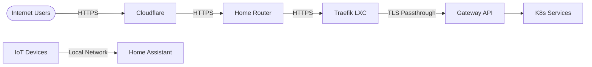
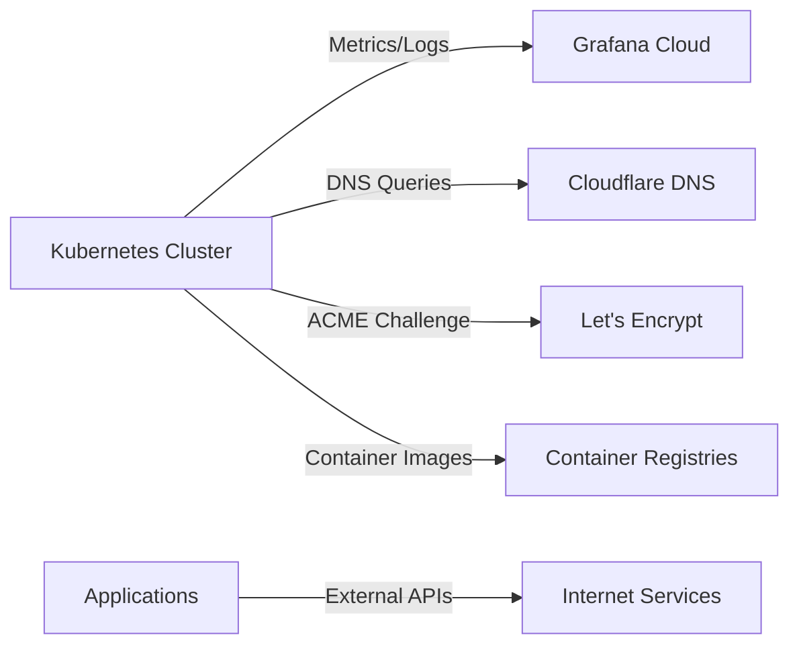

# System Context - HomeLab Infrastructure

## Overview

The HomeLab infrastructure is a self-hosted, Kubernetes-based platform running on Proxmox virtualization. It provides a foundation for running personal applications, home automation, media management, and productivity tools with enterprise-grade practices.

## System Purpose

The HomeLab serves multiple purposes:

- **Self-Hosted Applications**: Run privacy-focused alternatives to cloud services
- **Home Automation**: Integrate smart home devices and automation workflows
- **Learning Platform**: Experiment with cloud-native technologies and practices
- **Personal Productivity**: Host tools for document management, task tracking, and knowledge bases
- **Media Management**: Self-hosted photo storage and organization

## Users and Stakeholders

### Primary Users

- **Home Administrator**: Manages infrastructure, deploys applications, maintains security
- **Family Members**: Access self-hosted applications (photos, documents, home automation)
- **Developer/Learner**: Experiments with new technologies and deployment patterns

### External Stakeholders

- **Internet Users**: Access to publicly exposed services (with authentication)
- **Smart Home Devices**: IoT devices communicating with Home Assistant
- **Monitoring Services**: Grafana Cloud receiving telemetry data

## System Boundaries

### Internal Components (Inside HomeLab)

- Kubernetes cluster running on Talos Linux
- Proxmox hypervisor managing virtual machines
- Self-hosted applications and services
- Local storage and databases
- Internal networking and DNS

### External Dependencies (Outside HomeLab)

- **Internet Service Provider**: Network connectivity
- **Cloudflare**: DNS management, DDoS protection, dynamic DNS updates
- **Grafana Cloud**: Centralized monitoring, metrics, logs, and traces
- **Let's Encrypt**: TLS certificate issuance (via Cert-Manager)
- **Container Registries**: Docker Hub, GitHub Container Registry for images
- **Helm Charts**: Public Helm chart repositories for application deployments

## External Integrations

### Inbound Traffic

### Outbound Traffic

## Key System Characteristics

### Scale

- **Nodes**: 1 control plane node, 1 worker node
- **Applications**: ~15+ self-hosted applications
- **Storage**: Proxmox-based persistent storage
- **Network**: Single network segment with VLAN capability

### Performance

- **Availability Target**: Best-effort (home lab, not production)
- **Recovery Time**: Manual recovery, typically < 30 minutes
- **Backup Frequency**: Application-dependent (some daily, some none)

### Security Posture

- **Network Security**: Cilium network policies, Gateway API
- **Secret Management**: Sealed Secrets (encrypted at rest in Git)
- **TLS**: All external traffic encrypted via Let's Encrypt
- **Authentication**: Service-level authentication (no centralized SSO yet)
- **Updates**: Automated dependency updates via Renovate

## Technology Constraints

### Hardware Constraints

- **Limited Resources**: Single physical server with finite CPU/memory
- **No Redundancy**: Single point of failure for entire infrastructure
- **Network**: Residential ISP with dynamic IP (using DDNS)

### Software Constraints

- **Kubernetes Version**: Following Talos Linux support matrix
- **Storage**: Limited by Proxmox storage capabilities
- **Networking**: Must work with consumer-grade router

## Future Directions

### Planned Enhancements

- **Authentication**: Centralized authentication with Authelia or Zitadel
- **High Availability**: Multi-node cluster with storage replication
- **Backup Strategy**: Automated backup solution for critical data
- **Observability**: Enhanced monitoring with application-level metrics
- **Service Mesh**: Potential adoption of Istio or Linkerd for advanced traffic management

### Out of Scope

- **Public SaaS Offering**: This is a personal infrastructure, not a service provider
- **Multi-Tenancy**: Single-tenant system for personal/family use
- **Compliance Requirements**: No regulatory compliance requirements (HIPAA, SOC2, etc.)

## Related Documents

- [Container Architecture](02-container-architecture.md) - Detailed service architecture
- [Deployment Architecture](04-deployment-architecture.md) - Infrastructure layout
- [Security Architecture](05-security-architecture.md) - Security controls and boundaries
