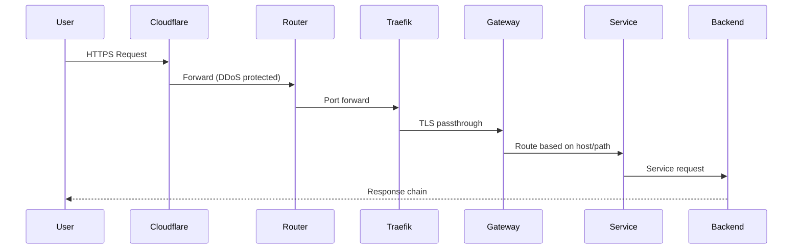
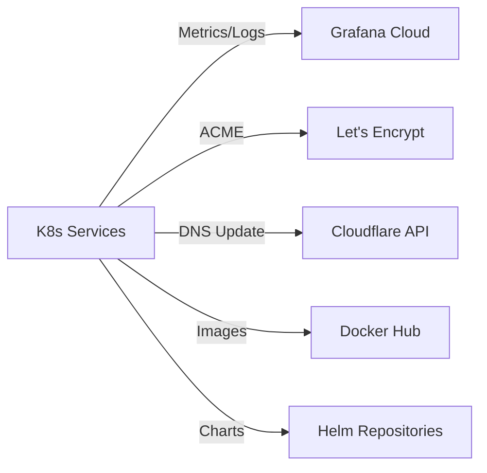

# Container Architecture - Service Architecture and Deployment

## Overview

The HomeLab infrastructure uses a containerized microservices architecture deployed on Kubernetes. Services are organized into three main categories: infrastructure, internal applications, and external-facing applications.

## Architecture Diagram

```mermaid
graph TB
    subgraph "Internet"
        Users[External Users]
        Monitoring[Grafana Cloud]
    end

    subgraph "Edge Layer"
        CF[Cloudflare DNS/CDN]
        Router[Home Router]
        Traefik[Traefik LXC Container]
    end

    subgraph "Kubernetes Cluster"
        subgraph "Infrastructure Layer"
            ArgoCD[ArgoCD<br/>GitOps]
            Gateway[Gateway API<br/>Ingress]
            CertManager[Cert-Manager<br/>TLS Certificates]
            Cilium[Cilium CNI<br/>Networking]
            SealedSecrets[Sealed Secrets<br/>Secret Management]
            CSI[Proxmox CSI<br/>Storage]
            GrafanaAgent[Grafana Agent<br/>Observability]
            CoreDNS[CoreDNS<br/>DNS]
        end

        subgraph "Internal Applications"
            Glance[Glance<br/>Dashboard]
            ISponsorBlockTV[iSponsorBlockTV<br/>YouTube Ad Blocker]
            ITTools[IT Tools<br/>Utilities]
            InboxZero[Inbox Zero<br/>Email Management]
        end

        subgraph "K8s External Applications"
            HAOS[Home Assistant<br/>Home Automation]
            OpenWebUI[Open WebUI<br/>AI Interface]
            Grafana[Grafana<br/>Dashboards]
            Proxmox[Proxmox Backup<br/>External Access]
            PocketID[PocketID<br/>Identity]
            ChangeDetection[Change Detection<br/>Website Monitoring]
        end
    end

    subgraph "Komodo Docker Host"
        KomodoSvc[Komodo<br/>Stack Manager]
        TraefikDocker[Traefik<br/>Reverse Proxy]
        subgraph "Docker Stacks"
            Immich[Immich<br/>Photo Storage]
            Paperless[Paperless-ngx<br/>Document Management]
            N8N[n8n<br/>Workflow Automation]
            Miniflux[Miniflux<br/>RSS Reader]
            Karakeep[Karakeep<br/>Bookmark Manager]
            ByteStash[ByteStash<br/>Snippet Storage]
            Dify[Dify<br/>AI Platform]
            Spotify[Spotify Tools]
            RSSHub[RSSHub<br/>RSS Generator]
        end
    end

    subgraph "Virtualization Layer"
        ProxmoxHost[Proxmox VE]
        TalosCP[Talos Control Plane<br/>VM]
        TalosWorker[Talos Worker Node<br/>VM]
        TraefikLXC[Traefik LXC]
        Storage[Proxmox Storage]
    end

    Users --> CF
    CF --> Router
    Router --> Traefik
    Router --> TraefikDocker
    Traefik --> Gateway
    Gateway --> K8s External Applications
    Gateway --> Internal Applications
    TraefikDocker --> Docker Stacks

    KomodoSvc -.->|Manages| Docker Stacks

    ArgoCD -.->|Manages| Infrastructure Layer
    ArgoCD -.->|Deploys| Internal Applications
    ArgoCD -.->|Deploys| K8s External Applications

    GrafanaAgent --> Monitoring

    Kubernetes Cluster --> ProxmoxHost
    CSI --> Storage
    TalosCP --> ProxmoxHost
    TalosWorker --> ProxmoxHost
    TraefikLXC --> ProxmoxHost
```

## Service Categories

### Infrastructure Services

These services provide foundational capabilities for the cluster.

#### ArgoCD (GitOps)
- **Purpose**: Continuous delivery and GitOps automation
- **Technology**: ArgoCD v5.53.2 (Helm chart)
- **Exposed**: https://argocd.ravil.space
- **Configuration**: `k8s/infra/argocd/`
- **Key Features**:
  - Auto-sync enabled for all applications
  - Self-healing capabilities
  - Kustomize with Helm support
  - RBAC with read-only default policy

#### Gateway API (Ingress)
- **Purpose**: Traffic routing and TLS termination
- **Technology**: Kubernetes Gateway API
- **Configuration**: `k8s/infra/network/gateway/`
- **Integration**: Works with Cilium as implementation
- **Features**:
  - HTTPRoute and TLSRoute resources
  - TLS passthrough from Traefik edge
  - Path-based and host-based routing

#### Cert-Manager (TLS Certificates)
- **Purpose**: Automated TLS certificate management
- **Technology**: cert-manager v1.16.1
- **Configuration**: `k8s/infra/security/cert-manager/`
- **Issuer**: Let's Encrypt (ACME HTTP01 challenge)
- **Certificate Lifecycle**: Automated issuance and renewal

#### Cilium (Networking)
- **Purpose**: Container Network Interface (CNI) and network policies
- **Technology**: Cilium (eBPF-based)
- **Configuration**: `k8s/infra/network/cilium/`
- **Deployed**: Via Talos inline manifest during bootstrap
- **Features**:
  - eBPF-based networking
  - Network policies
  - Gateway API implementation
  - Service mesh capabilities (optional)

#### Sealed Secrets (Secret Management)
- **Purpose**: Encrypted secrets safe for Git storage
- **Technology**: Bitnami Sealed Secrets
- **Configuration**: `terraform/modules/sealed-secrets/`
- **Certificate**: Custom certificate for reproducible sealing
- **Workflow**: Seal secrets using Terraform-managed certificate

#### Proxmox CSI (Storage)
- **Purpose**: Dynamic persistent volume provisioning
- **Technology**: Proxmox CSI Plugin
- **Configuration**: `terraform/modules/proxmox-csi-plugin/`
- **Backend**: Proxmox VE storage
- **Features**: Dynamic PV creation, volume expansion

#### Grafana Agent (Observability)
- **Purpose**: Metrics, logs, and traces collection
- **Technology**: Grafana Agent
- **Configuration**: `terraform/modules/monitoring/`
- **Backend**: Grafana Cloud
- **Data Types**: Prometheus metrics, Loki logs, Tempo traces

#### CoreDNS (DNS)
- **Purpose**: Cluster DNS resolution
- **Technology**: CoreDNS
- **Configuration**: `k8s/infra/network/coredns/`
- **Integration**: Kubernetes DNS service

#### Cloudflare DDNS
- **Purpose**: Dynamic DNS updates
- **Technology**: Custom CronJob
- **Configuration**: `k8s/infra/network/cloudflare-ddns/`
- **Function**: Updates Cloudflare DNS A records with current public IP

### Internal Applications

Services accessible only from internal network or through VPN.

#### Glance (Dashboard)
- **Namespace**: glance
- **Purpose**: Personal dashboard with widgets
- **Configuration**: `k8s/apps/internal/glance/`
- **Restart**: `make glance-restart`

#### iSponsorBlockTV
- **Namespace**: isponsorblocktv
- **Purpose**: YouTube ad/sponsor segment blocking for smart TVs
- **Configuration**: `k8s/apps/internal/isponsorblocktv/`
- **Restart**: `make isponsorblocktv-restart`

#### IT Tools
- **Namespace**: it-tools
- **Purpose**: Collection of IT utility tools
- **Configuration**: `k8s/apps/internal/it-tools/`

#### Inbox Zero
- **Namespace**: inbox-zero
- **Purpose**: Email management and organization
- **Configuration**: `k8s/apps/internal/inbox-zero/`
- **Special**: Requires sealed secrets for email credentials

### External Applications (Kubernetes — via Gateway API)

Services routed through the Kubernetes Gateway API and exposed via Cloudflare DNS.

#### Home Assistant OS
- **Domain**: haos.ravil.space
- **Purpose**: Home automation platform
- **Configuration**: `k8s/apps/external/haos/`
- **Special**: External service pointing to HAOS VM

#### Open WebUI
- **Domain**: openwebui.ravil.space
- **Purpose**: Web interface for AI models
- **Configuration**: `k8s/apps/external/openwebui/`

#### Grafana
- **Domain**: grafana.ravil.space
- **Purpose**: Monitoring dashboards
- **Configuration**: `k8s/apps/external/grafana/`

#### PocketID
- **Domain**: pocketid.ravil.space
- **Purpose**: OIDC identity provider
- **Configuration**: `k8s/apps/external/pocketid/`

#### Change Detection
- **Domain**: changedetection.ravil.space
- **Purpose**: Website change monitoring
- **Configuration**: `k8s/apps/external/changedetection/`

#### Proxmox
- **Domain**: proxmox.ravil.space
- **Purpose**: Proxmox VE external access (TLS passthrough)
- **Configuration**: `k8s/apps/external/proxmox/`

### Docker Stacks (Komodo — via Traefik)

Services deployed as Docker compose stacks managed by Komodo. Traffic is routed directly through the Komodo host's Traefik instance, bypassing the Kubernetes Gateway API.

- **Immich** — Photo management (`stacks/immich/`)
- **Paperless-ngx** — Document management with OCR (`stacks/paperless-ngx/`)
- **n8n** — Workflow automation (`stacks/n8n/`)
- **Miniflux** — RSS feed reader (`stacks/miniflux/`)
- **Karakeep** — Bookmark manager (`stacks/karakeep/`)
- **ByteStash** — Code snippet storage (`stacks/bytestash/`)
- **Dify** — AI application platform (no stack yet)
- **Your Spotify** — Spotify stats (`stacks/your_spotify/`)
- **RSSHub** — RSS feed generator (`stacks/rsshub/`)
- **Nextflux** — RSS reader frontend (`stacks/nextflux/`)
- **S-PDF** — PDF tools (`stacks/s-pdf/`)
- **Dozzle** — Container log viewer (`stacks/dozzle/`)

## Service Communication Patterns

### Request Flow



### Internal Service Communication

- Services communicate via Kubernetes ClusterIP services
- DNS resolution via CoreDNS
- Network policies enforced by Cilium
- East-west traffic within cluster network

### External Dependencies



## Deployment Patterns

### GitOps Deployment

All applications are deployed through ArgoCD:

1. Manifest changes pushed to Git repository
2. ArgoCD detects changes (webhook or polling)
3. ArgoCD syncs cluster state to match Git
4. Health checks verify deployment success
5. Self-healing corrects any drift

### Kustomize Structure

Standard structure for each application:

```
k8s/apps/[category]/[app]/
├── kustomization.yaml    # Kustomize configuration
├── namespace.yaml        # Namespace definition
├── deployment.yaml       # Deployment spec
├── service.yaml         # Service definition
├── gateway-route.yaml   # Gateway API routing (if external)
├── sealed-secret.yaml   # Encrypted secrets (if needed)
└── values.yaml         # Helm values (if using Helm)
```

### Bootstrap Process

See [Makefile](../../Makefile) `bootstrap` target:

1. Terraform provisions Proxmox VMs and Talos cluster
2. Cilium CNI deployed via Talos inline manifest
3. Critical CRDs applied
4. Cert-Manager deployed for certificate management
5. ArgoCD deployed for GitOps
6. ArgoCD takes over remaining deployments

## Service Dependencies

### Critical Path

```
Proxmox → Talos VMs → Cilium CNI → Cert-Manager → ArgoCD → Applications
```

### Infrastructure Dependencies

- **All Services**: Depend on Cilium for networking
- **External Services**: Depend on Gateway API and Cert-Manager
- **Stateful Services**: Depend on Proxmox CSI
- **All Applications**: Managed by ArgoCD (except bootstrap components)

## Scaling Considerations

### Current Limitations

- Single control plane node (no HA)
- Single worker node (no horizontal scaling)
- Limited by physical hardware resources
- No auto-scaling configured

### Future Scaling

- Add additional worker nodes for horizontal scaling
- Implement multi-control-plane for HA
- Configure Horizontal Pod Autoscaler (HPA)
- Consider resource quotas and limits per namespace

## Related Documents

- [Component Architecture](03-component-architecture.md) - Detailed component internals
- [Deployment Architecture](04-deployment-architecture.md) - Infrastructure topology
- [Security Architecture](05-security-architecture.md) - Security controls
