# Deployment Architecture - Infrastructure and Deployment Patterns

## Overview

The HomeLab infrastructure is deployed on a single physical server running Proxmox VE, which hosts the Talos Linux Kubernetes cluster and supporting services. This document describes the physical and logical deployment architecture.

## Physical Architecture

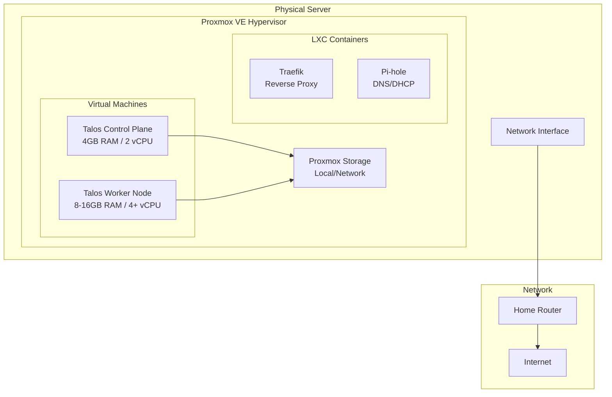

## Network Architecture

### Network Topology

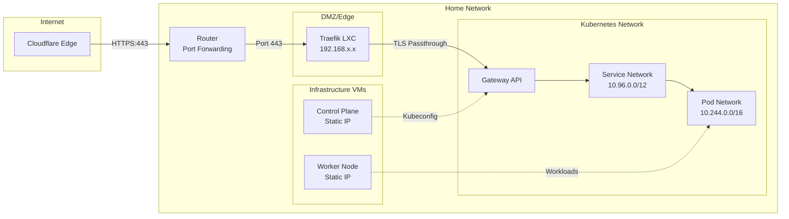

### IP Addressing

| Component | IP Address | Type |
|-----------|-----------|------|
| Proxmox Host | 192.168.x.1 | Static |
| Talos Control Plane | Variable (from vars) | Static |
| Talos Worker Node | Variable (from vars) | Static |
| Traefik LXC | 192.168.x.x | Static |
| Pi-hole (planned) | TBD | Static |
| Pod Network | 10.244.0.0/16 | CIDR |
| Service Network | 10.96.0.0/12 | CIDR |

### Port Mappings

#### External (Router → Services)

| Port | Protocol | Destination | Purpose |
|------|----------|-------------|---------|
| 443 | TCP | Traefik LXC | HTTPS traffic |
| 80 | TCP | Traefik LXC | HTTP (redirect to HTTPS) |

#### Internal (Traefik → Kubernetes)

| Port | Protocol | Destination | Purpose |
|------|----------|-------------|---------|
| 443 | TCP | Gateway API | TLS passthrough |
| Various | TCP | NodePort Services | Application-specific |

## Kubernetes Cluster Architecture

### Node Topology

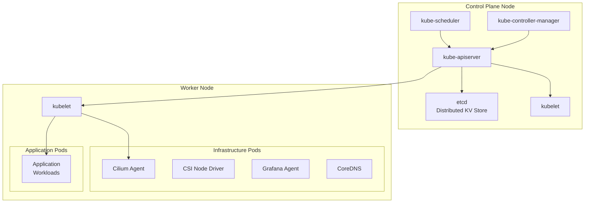

### Talos Linux Architecture

Talos Linux is an immutable, API-driven Kubernetes OS:

- **Immutable**: OS is read-only, updates via image replacement
- **API-Driven**: All configuration via API (no SSH by default)
- **Secure**: Minimal attack surface, all components in containers
- **Kubernetes-Focused**: Built specifically for running Kubernetes

#### Talos Components

```
┌─────────────────────────────────────┐
│         Talos Linux Node            │
├─────────────────────────────────────┤
│  Kernel (Linux)                     │
├─────────────────────────────────────┤
│  apid (Talos API Server)            │
│  trustd (Certificate Management)     │
├─────────────────────────────────────┤
│  containerd (Container Runtime)      │
├─────────────────────────────────────┤
│  kubelet                             │
│  kube-proxy (if not using Cilium)    │
├─────────────────────────────────────┤
│  User Workloads (Pods)              │
└─────────────────────────────────────┘
```

## Terraform Infrastructure Deployment

### Module Structure

```
terraform/
├── main.tf              # Root module, orchestrates all modules
├── providers.tf         # Provider configurations
├── variables.tf         # Input variables
├── outputs.tf          # Output values
└── modules/
    ├── proxmox/        # Proxmox VM provisioning
    ├── talos/          # Talos cluster bootstrap
    ├── monitoring/     # Grafana Cloud agent
    ├── proxmox-csi-plugin/  # Storage plugin
    ├── sealed-secrets/ # Secret management
    └── traefik/        # Edge reverse proxy
```

### Terraform Execution Flow

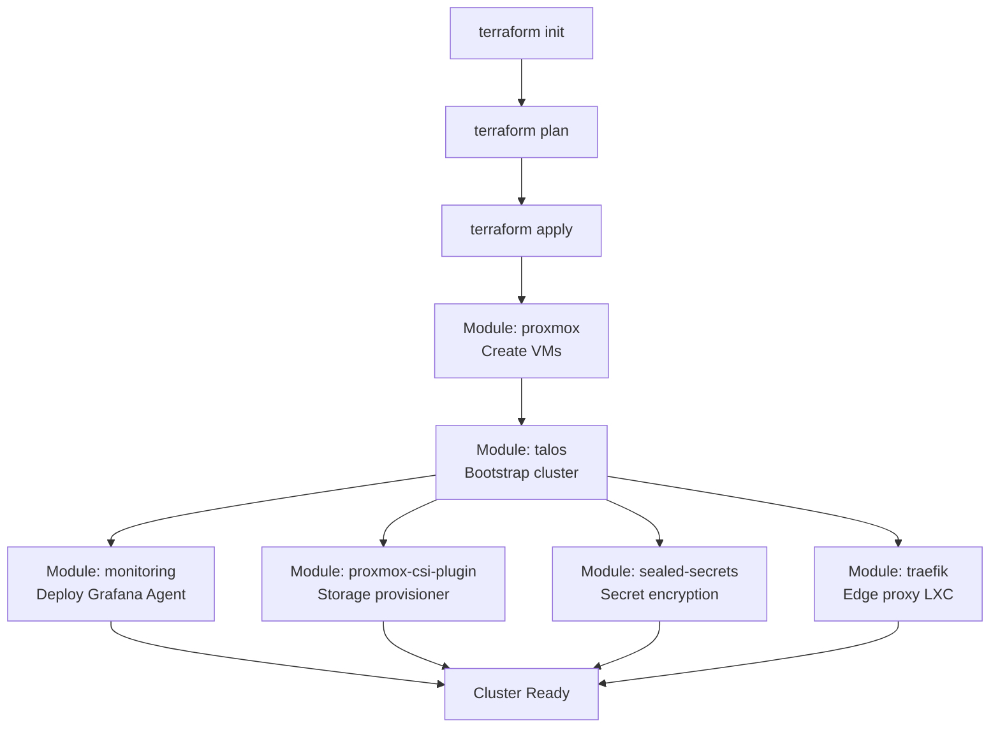

### Module Dependencies

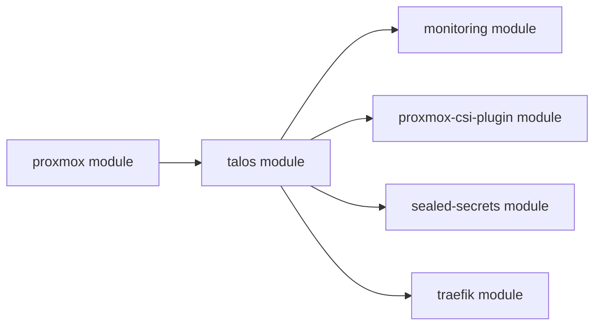

## Kubernetes Application Deployment

### ArgoCD GitOps Flow

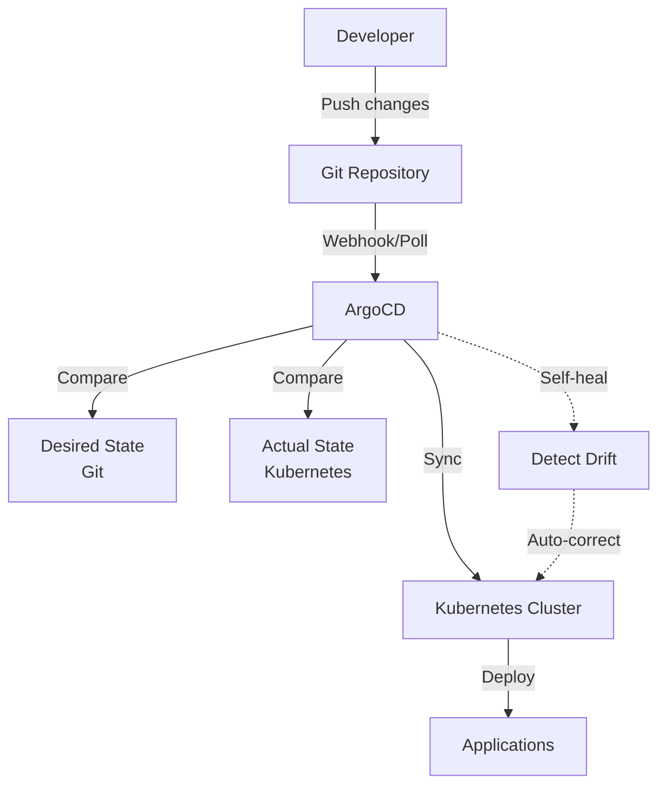

### Application Structure

Each application follows a standard Kustomize structure:

```
k8s/apps/[category]/[app]/
├── kustomization.yaml
├── namespace.yaml
├── deployment.yaml
├── service.yaml
├── configmap.yaml (optional)
├── sealed-secret.yaml (optional)
├── pvc.yaml (optional)
└── gateway-route.yaml (if external)
```

### ArgoCD Application Configuration

Applications are defined in `k8s/infra/argocd/applications/`:

```yaml
apiVersion: argoproj.io/v1alpha1
kind: Application
metadata:
  name: example-app
  namespace: argocd
spec:
  project: default
  source:
    repoURL: https://github.com/user/homelab
    targetRevision: main
    path: k8s/apps/external/example-app
  destination:
    server: https://kubernetes.default.svc
    namespace: example-app
  syncPolicy:
    automated:
      prune: true
      selfHeal: true
    syncOptions:
      - CreateNamespace=true
```

## Storage Architecture

### Proxmox Storage Integration

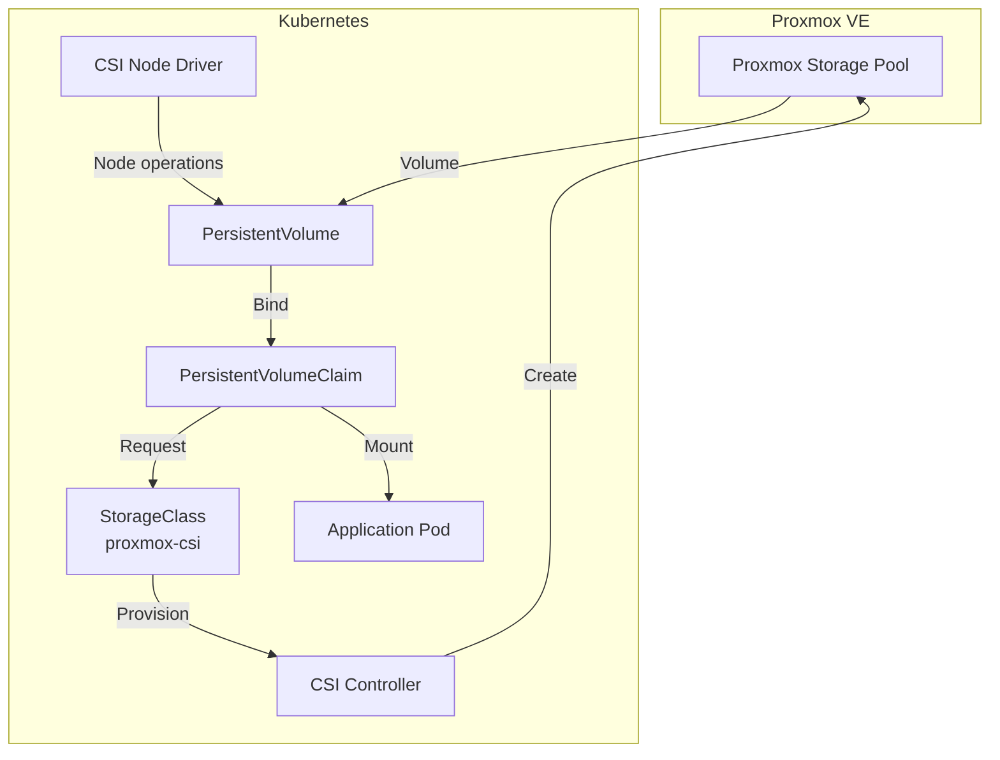

### Storage Classes

| Storage Class | Provisioner | Reclaim Policy | Use Case |
|---------------|-------------|----------------|----------|
| proxmox-csi | csi.proxmox.sinextra.dev | Delete | General purpose |
| proxmox-csi (default) | csi.proxmox.sinextra.dev | Delete | Default for PVCs |

### Persistent Volumes

- **Dynamic Provisioning**: CSI plugin creates volumes on-demand
- **Reclaim Policy**: Delete (volumes deleted when PVC is deleted)
- **Access Modes**: ReadWriteOnce (single node access)
- **Backend**: Proxmox storage pools (local or network storage)

## Bootstrap Process

### Complete Bootstrap Flow

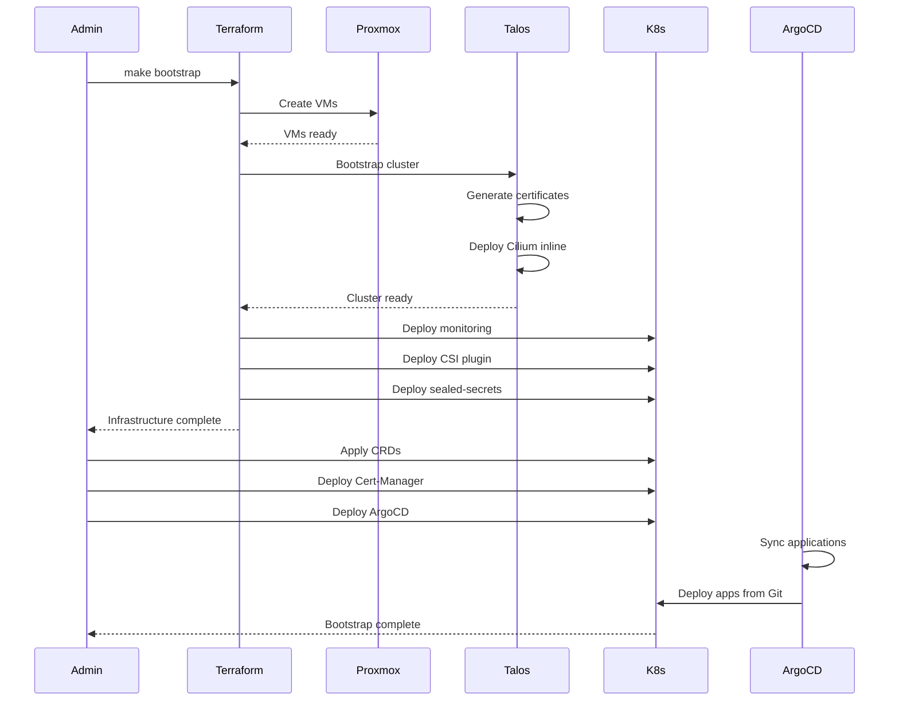

### Bootstrap Steps (Detailed)

1. **Terraform Initialization**
   ```bash
   make terraform-init
   terraform -chdir=./terraform init
   ```

2. **Terraform Planning**
   ```bash
   make terraform-plan
   terraform -chdir=./terraform plan
   ```

3. **Terraform Apply**
   ```bash
   make terraform-apply
   terraform -chdir=./terraform apply -auto-approve
   ```
   - Creates Talos VMs on Proxmox
   - Bootstraps Talos cluster
   - Deploys Cilium via inline manifest
   - Deploys Grafana Agent
   - Deploys Proxmox CSI Plugin
   - Deploys Sealed Secrets controller
   - Creates Traefik LXC container

4. **Kubeconfig Export**
   ```bash
   make kubeconfig
   terraform -chdir=./terraform output -raw kubeconfig_content > ~/.kube/config
   ```

5. **Kubernetes Bootstrap**
   ```bash
   make k8s-apply
   ```
   - Patches default storage class
   - Applies Gateway API CRDs
   - Deploys Cilium (if not inline)
   - Deploys Cert-Manager
   - Deploys ArgoCD

6. **ArgoCD Takes Over**
   - ArgoCD syncs application manifests from Git
   - Deploys all applications automatically
   - Maintains desired state via GitOps

## Upgrade Strategies

### Talos Upgrade

```bash
# Upgrade Talos OS version
talosctl upgrade --nodes <node-ip> --image ghcr.io/siderolabs/installer:v1.x.x

# Upgrade Kubernetes version
talosctl upgrade-k8s --to 1.30.x
```

### Application Updates

- **Automated**: Renovate bot creates PRs for dependency updates
- **Manual Review**: Review and merge Renovate PRs
- **ArgoCD Sync**: ArgoCD automatically deploys merged changes
- **Rollback**: Revert Git commit and ArgoCD re-syncs

### Infrastructure Updates

```bash
# Update Terraform modules
terraform -chdir=./terraform plan
terraform -chdir=./terraform apply

# Update Helm releases
helm upgrade <release> <chart> -n <namespace> -f values.yaml
```

## Disaster Recovery

### Backup Targets

- **etcd**: Automatic snapshots via Talos
- **Application Data**: Application-specific backups (e.g., Immich, Paperless)
- **Configuration**: Git repository (infrastructure as code)
- **Secrets**: Sealed secret keys stored securely

### Recovery Procedures

1. **Full Cluster Rebuild**
   ```bash
   make bootstrap  # Rebuilds entire infrastructure
   ```

2. **Application Recovery**
   - ArgoCD re-syncs from Git automatically
   - Restore application data from backups
   - Recreate sealed secrets using original certificate

3. **Partial Recovery**
   ```bash
   kubectl kustomize --enable-helm ./k8s/apps/external/<app> | kubectl apply -f -
   ```

## Monitoring and Observability

### Metrics Collection

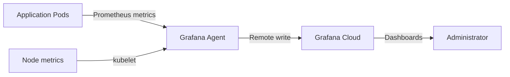

### Logs Collection

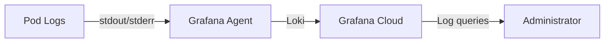

### Traces (Optional)

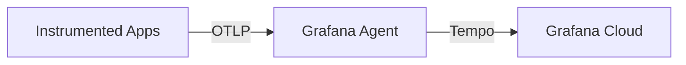

## Scaling and Capacity

### Current Capacity

- **Control Plane**: 1 node, 4GB RAM, 2 vCPU
- **Worker Nodes**: 1 node, 8-16GB RAM, 4+ vCPU
- **Storage**: Limited by Proxmox host storage
- **Network**: Single gigabit NIC

### Scaling Options

1. **Vertical Scaling**
   - Increase VM resources (RAM, CPU)
   - Expand Proxmox storage

2. **Horizontal Scaling**
   - Add additional worker nodes
   - Distribute workloads across nodes
   - Implement pod anti-affinity

3. **Storage Scaling**
   - Add network storage (NFS, Ceph)
   - Expand local storage pools

## Related Documents

- [System Context](01-system-context.md) - High-level overview
- [Container Architecture](02-container-architecture.md) - Service architecture
- [Security Architecture](05-security-architecture.md) - Security controls
- [Runbooks](../runbooks/) - Operational procedures
