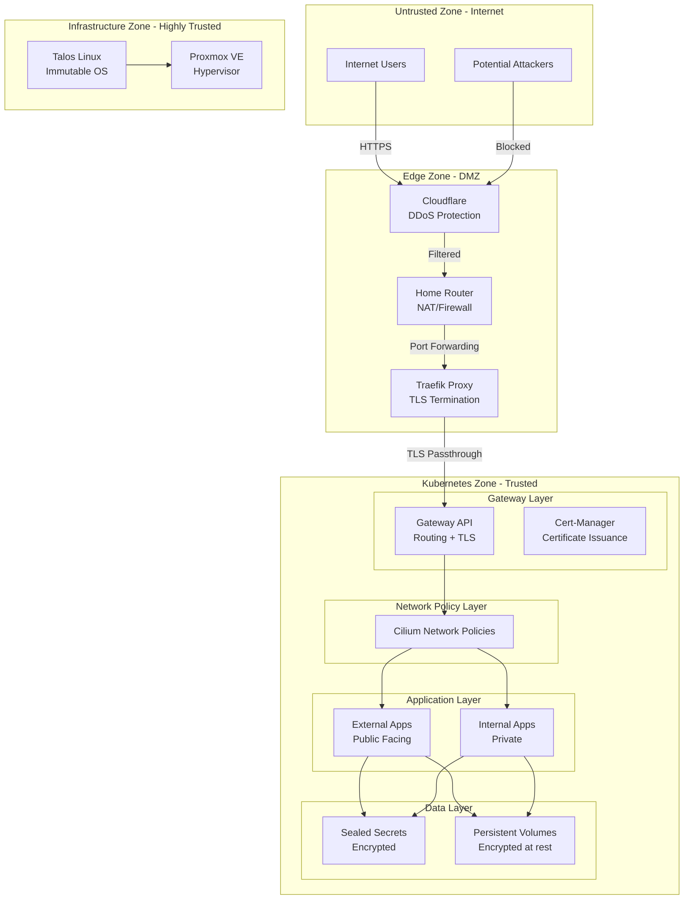
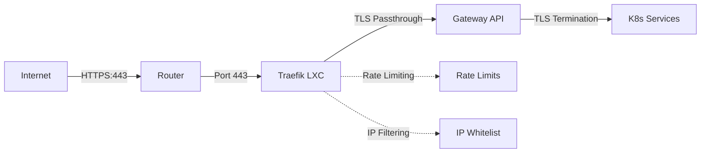
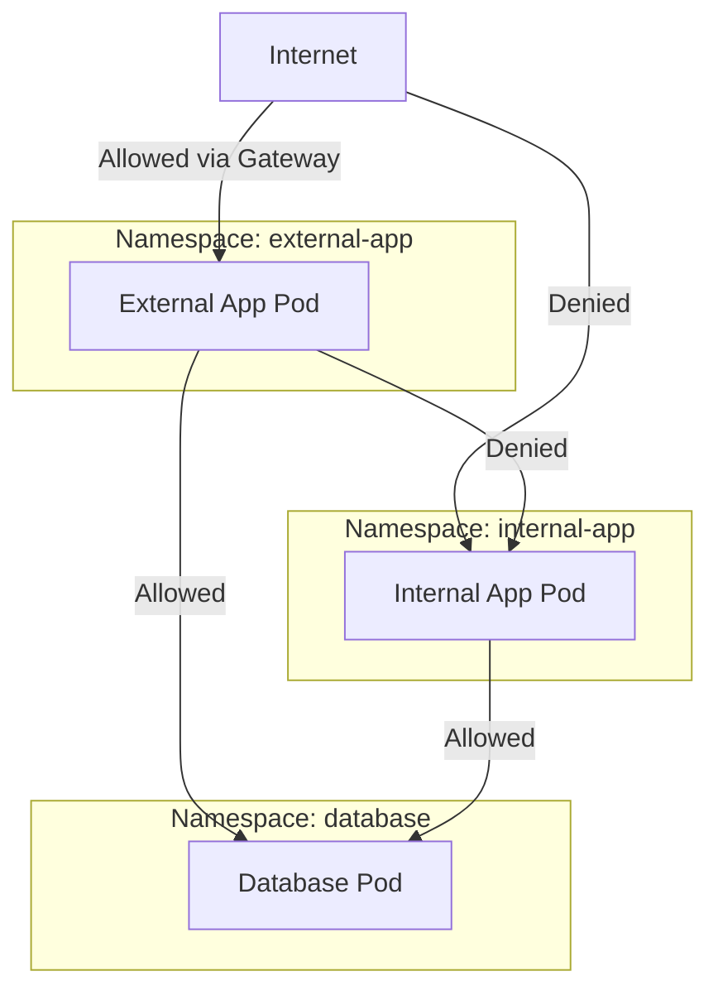
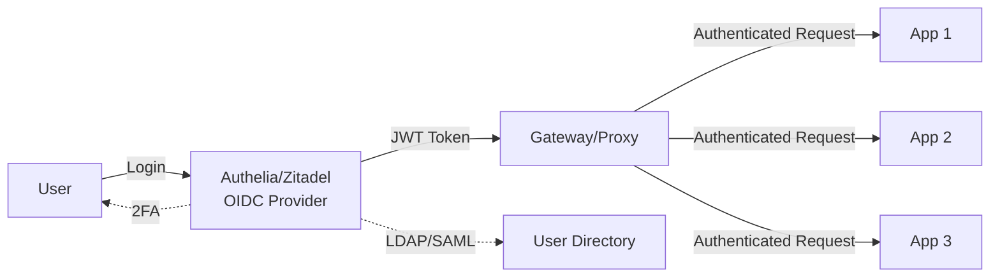
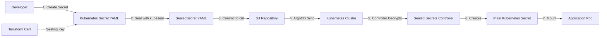
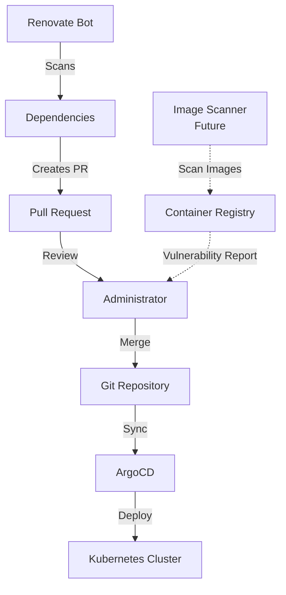
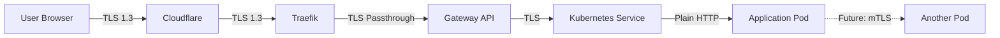
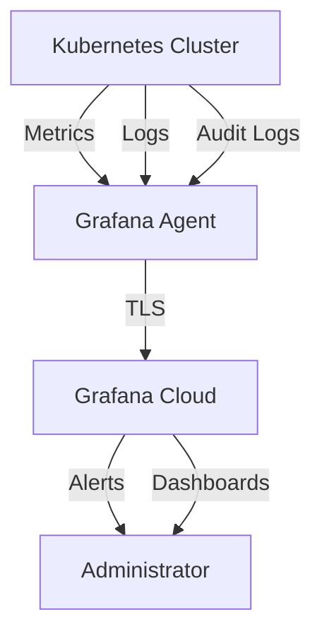

# Security Architecture - Security Controls and Boundaries

## Overview

The HomeLab infrastructure implements defense-in-depth security practices across network, application, and data layers. This document describes security controls, boundaries, and threat mitigation strategies.

## Security Principles

1. **Least Privilege**: Services and users have minimal necessary permissions
2. **Defense in Depth**: Multiple layers of security controls
3. **Zero Trust**: Don't trust internal network by default
4. **Immutability**: Immutable infrastructure reduces attack surface
5. **Encryption**: Encrypt data in transit and sensitive data at rest
6. **Automation**: Automate security patching and updates
7. **Visibility**: Comprehensive logging and monitoring

## Security Zones and Trust Boundaries



## Network Security

### Edge Protection

#### Cloudflare Protection
- **DDoS Mitigation**: Cloudflare filters malicious traffic before it reaches the network
- **WAF**: Web Application Firewall rules (configurable)
- **Rate Limiting**: Prevent brute force attacks
- **Geographic Filtering**: Block traffic from specific countries (optional)
- **Bot Protection**: Identify and block malicious bots
- **DNS Management**: DNSSEC support, hidden origin IP

#### Home Router Firewall
- **NAT**: Network Address Translation hides internal IPs
- **Port Forwarding**: Only ports 80 and 443 forwarded to Traefik
- **Stateful Firewall**: Blocks unsolicited inbound connections
- **Local Network Isolation**: IoT devices on separate VLAN (optional)

### Traefik Edge Proxy



**Features**:
- TLS passthrough (TLS termination happens at Gateway API)
- Rate limiting per route
- IP whitelisting for sensitive services
- Access logging for audit trail
- Middleware for additional security headers

### Gateway API Security

**TLS Configuration**:
- Let's Encrypt certificates via Cert-Manager
- TLS 1.2 and 1.3 only (no TLS 1.0/1.1)
- Strong cipher suites
- HTTP to HTTPS redirect
- HSTS headers

**Routing Security**:
- Host-based routing (domain validation)
- Path-based routing with strict matching
- Backend protocol validation
- Request/response header manipulation

### Cilium Network Policies

Cilium enforces network policies at the pod level using eBPF:



**Network Policy Example**:

```yaml
apiVersion: cilium.io/v2
kind: CiliumNetworkPolicy
metadata:
  name: allow-ingress-from-gateway
  namespace: immich
spec:
  endpointSelector:
    matchLabels:
      app: immich
  ingress:
    - fromEndpoints:
        - matchLabels:
            io.kubernetes.pod.namespace: gateway-system
      toPorts:
        - ports:
            - port: "3001"
              protocol: TCP
```

**Key Policies**:
- Default deny all traffic
- Explicit allow for necessary communication
- Namespace isolation
- External egress control
- DNS policy enforcement

### Service Mesh (Future)

Consider implementing Istio or Linkerd for:
- Mutual TLS (mTLS) between services
- Traffic encryption within cluster
- Advanced traffic management
- Service-to-service authentication

## Application Security

### Authentication and Authorization

#### Current State

- **Per-Service Authentication**: Each application manages its own users
- **No Centralized SSO**: Users must log in to each service separately
- **Password-Based**: Most services use username/password authentication
- **API Tokens**: Some services support API token authentication

#### Future: Centralized Authentication (Planned)



**Planned Implementation**:
- **OIDC Provider**: Authelia or Zitadel
- **Single Sign-On**: One login for all services
- **Multi-Factor Authentication**: TOTP, WebAuthn
- **Session Management**: Centralized session handling
- **Access Policies**: Define who can access what

### Secret Management

#### Sealed Secrets



**Security Properties**:
- Secrets encrypted at rest in Git repository
- Only cluster can decrypt (private key never leaves cluster)
- Scope: strict namespace binding
- Certificate managed by Terraform (reproducible)
- Rotation: Manual certificate rotation process

**Best Practices**:
```bash
# Always use strict scope
kubeseal \
  --cert ../../../../terraform/modules/sealed-secrets/certs/sealed-secrets.cert \
  --scope strict \
  --namespace <namespace> \
  --name <secret-name> \
  --format yaml
```

#### Secret Rotation

- **Application Secrets**: Rotate via sealed secret recreation
- **TLS Certificates**: Auto-renewed by Cert-Manager
- **Sealed Secrets Certificate**: Manual rotation (annual)

### Container Security

#### Image Security

- **Trusted Registries**: Pull from Docker Hub, GHCR, Quay.io
- **Image Scanning**: Use Trivy or Grype for vulnerability scanning (future)
- **Image Signing**: Verify image signatures with Cosign (future)
- **No Latest Tags**: Pin specific versions in manifests
- **Automated Updates**: Renovate bot for dependency updates

#### Runtime Security

**Talos Linux Security**:
- Immutable OS (no package installation)
- No SSH access (reduces attack surface)
- API-driven (all operations auditable)
- Minimal attack surface (no unnecessary services)
- Secure boot (optional, with UEFI)

**Kubernetes Pod Security**:
```yaml
securityContext:
  runAsNonRoot: true
  runAsUser: 1000
  fsGroup: 1000
  allowPrivilegeEscalation: false
  capabilities:
    drop:
      - ALL
  readOnlyRootFilesystem: true
```

**Future: Pod Security Standards**:
- Enforce restricted Pod Security Standards
- Use OPA/Gatekeeper for policy enforcement
- Implement security contexts for all workloads

### RBAC (Role-Based Access Control)

#### Kubernetes RBAC

```yaml
# Example: Read-only cluster viewer
apiVersion: rbac.authorization.k8s.io/v1
kind: ClusterRole
metadata:
  name: cluster-viewer
rules:
  - apiGroups: ["*"]
    resources: ["*"]
    verbs: ["get", "list", "watch"]
```

**Current Roles**:
- **Cluster Admin**: Full cluster access (via kubeconfig)
- **ArgoCD Admin**: Manage all ArgoCD applications
- **ArgoCD Readonly**: View-only access to ArgoCD

**Best Practices**:
- Separate kubeconfigs for different access levels
- Service accounts for applications
- Least privilege for all service accounts
- Regular RBAC audit

### Vulnerability Management



**Current Process**:
1. Renovate bot detects outdated dependencies
2. Creates pull request with updates
3. Administrator reviews changes
4. Merge triggers ArgoCD sync
5. Updated application deployed

**Future Enhancements**:
- Automated image scanning in CI/CD
- Runtime vulnerability detection
- Policy-based deployment blocking for critical vulnerabilities

## Data Security

### Encryption at Rest

**Storage**:
- **Proxmox Storage**: Optional encryption via LUKS
- **Persistent Volumes**: Encryption depends on backend
- **Application Data**: Application-specific encryption (e.g., database encryption)

**Secrets**:
- **Sealed Secrets**: Encrypted in Git
- **Kubernetes Secrets**: Base64 encoded (not encrypted) in etcd
- **Future**: etcd encryption at rest

### Encryption in Transit



**Current State**:
- External traffic: Encrypted end-to-end (User → Gateway)
- Internal traffic: Plain HTTP (within Kubernetes)

**Future State**:
- Implement service mesh for mTLS
- Encrypt all inter-service communication
- Mutual authentication between services

### Backup Security

**Considerations**:
- Encrypted backups for sensitive data
- Secure backup storage location
- Access controls on backup data
- Regular backup testing
- Disaster recovery procedures

## Monitoring and Logging

### Security Monitoring



**What to Monitor**:
- Failed authentication attempts
- Unauthorized API calls
- Network policy violations
- Certificate expiration
- Unusual traffic patterns
- Resource consumption anomalies
- Pod crashes and restarts

### Audit Logging

**Kubernetes Audit Logs**:
- API server audit logging
- Who did what, when
- Track configuration changes
- Investigate security incidents

**Application Logs**:
- Centralized logging via Grafana Loki
- Structured logging (JSON)
- Log retention policies
- Log analysis and alerting

## Compliance and Best Practices

### Security Hardening Checklist

- [x] Immutable OS (Talos Linux)
- [x] No SSH access to nodes
- [x] TLS for all external traffic
- [x] Secrets encrypted in Git (Sealed Secrets)
- [x] Automatic certificate management
- [x] Regular dependency updates (Renovate)
- [x] Network segmentation (Namespaces)
- [ ] Network policies enforced (partially implemented)
- [ ] Pod Security Standards enforced
- [ ] Container image scanning
- [ ] Centralized authentication (planned)
- [ ] Multi-factor authentication
- [ ] Backup encryption
- [ ] Disaster recovery plan

### CIS Kubernetes Benchmark

While not all CIS benchmarks apply to HomeLab, consider:
- API server security configuration
- etcd security
- Kubelet security settings
- Pod Security Standards
- Network policies
- RBAC configuration

### Regular Security Tasks

**Daily**:
- Monitor Grafana dashboards for anomalies

**Weekly**:
- Review Renovate PRs for security updates
- Check ArgoCD for sync errors

**Monthly**:
- Review access logs for suspicious activity
- Audit RBAC permissions
- Check certificate expiration dates

**Quarterly**:
- Rotate critical credentials
- Review and update network policies
- Test disaster recovery procedures
- Security architecture review

## Incident Response

### Detection

- Grafana Cloud alerts for anomalies
- Failed login monitoring
- Resource consumption alerts
- Network policy violation alerts

### Response Plan

1. **Identify**: Determine nature and scope of incident
2. **Contain**: Isolate affected systems
3. **Eradicate**: Remove threat (pod deletion, network policies)
4. **Recover**: Restore from known-good state (Git revert + ArgoCD sync)
5. **Lessons Learned**: Document incident and improve defenses

### Recovery Procedures

**Compromised Pod**:
```bash
# Delete compromised pod
kubectl delete pod <pod-name> -n <namespace>

# ArgoCD will recreate from Git (known-good state)
# Or manually apply
kubectl kustomize ./k8s/apps/<app> | kubectl apply -f -
```

**Cluster Compromise**:
```bash
# Nuclear option: rebuild entire cluster
make bootstrap
```

## Future Security Enhancements

### Short Term (3-6 months)

- [ ] Implement Authelia or Zitadel for SSO
- [ ] Enable comprehensive network policies for all apps
- [ ] Implement Pod Security Standards
- [ ] Set up automated vulnerability scanning

### Medium Term (6-12 months)

- [ ] Deploy service mesh for mTLS
- [ ] Implement etcd encryption at rest
- [ ] Set up intrusion detection (Falco)
- [ ] Automated security testing in CI/CD

### Long Term (1+ year)

- [ ] Zero-trust architecture with mTLS everywhere
- [ ] Hardware security module (HSM) for key management
- [ ] Compliance automation (CIS benchmarks)
- [ ] Security chaos engineering

## Related Documents

- [System Context](01-system-context.md) - System boundaries
- [Container Architecture](02-container-architecture.md) - Service architecture
- [Deployment Architecture](04-deployment-architecture.md) - Network topology
- [ADR 0004: Sealed Secrets](../adr/0004-use-sealed-secrets.md)
