# Data Architecture - Data Flows and Storage

## Overview

This document describes data flows, storage patterns, and data management strategies across the HomeLab infrastructure.

## Data Flow Diagram

```mermaid
graph TB
    subgraph "External Data Sources"
        Users[Users/Browsers]
        IoT[IoT Devices]
        APIs[External APIs]
    end

    subgraph "Edge Layer"
        Traefik[Traefik Proxy]
    end

    subgraph "Application Layer"
        subgraph "External Apps"
            Immich[Immich<br/>Photos]
            HAOS[Home Assistant]
            Paperless[Paperless<br/>Documents]
            N8N[n8n<br/>Workflows]
        end

        subgraph "Internal Apps"
            Glance[Glance]
            ISponsorBlockTV[iSponsorBlockTV]
            InboxZero[Inbox Zero]
        end
    end

    subgraph "Data Layer"
        subgraph "Application Databases"
            ImmichDB[(Immich<br/>PostgreSQL)]
            PaperlessDB[(Paperless<br/>PostgreSQL)]
            HAOSDB[(Home Assistant<br/>SQLite)]
            N8NDB[(n8n<br/>SQLite/Postgres)]
        end

        subgraph "Persistent Storage"
            PV1[Immich Photos<br/>PVC]
            PV2[Paperless Docs<br/>PVC]
            PV3[HAOS Config<br/>PVC]
            PV4[N8N Data<br/>PVC]
        end

        subgraph "Caching Layer"
            Redis[Redis<br/>Cache]
        end
    end

    subgraph "Infrastructure Layer"
        ProxmoxStorage[(Proxmox<br/>Storage Pool)]
    end

    subgraph "Observability Layer"
        GrafanaAgent[Grafana Agent]
        GrafanaCloud[(Grafana Cloud)]
    end

    Users --> Traefik
    IoT --> Traefik
    Traefik --> External Apps
    External Apps --> Application Databases
    External Apps --> Persistent Storage
    Internal Apps --> Application Databases
    Application Databases --> ProxmoxStorage
    Persistent Storage --> ProxmoxStorage

    External Apps --> Redis
    External Apps --> APIs
    N8N --> APIs

    Application Layer --> GrafanaAgent
    GrafanaAgent --> GrafanaCloud
```

## Data Types and Classification

### User Data

| Data Type | Application | Storage | Backup Priority | Retention |
|-----------|-------------|---------|-----------------|-----------|
| Photos/Videos | Immich | PVC (object storage) | Critical | Indefinite |
| Documents | Paperless | PVC + PostgreSQL | Critical | Indefinite |
| Home automation config | Home Assistant | PVC (YAML + SQLite) | High | Indefinite |
| Workflow definitions | n8n | SQLite/PostgreSQL | Medium | Indefinite |
| Email data | Inbox Zero | Transient | Low | 30 days |

### Application Data

| Data Type | Storage | Purpose | Retention |
|-----------|---------|---------|-----------|
| Container images | Proxmox local | Container registry cache | Until cleanup |
| Helm charts | Temporary | Deployment artifacts | N/A |
| ArgoCD state | etcd | GitOps sync state | Until resource deletion |
| Sealed secrets | Git + etcd | Encrypted credentials | Indefinite |

### Infrastructure Data

| Data Type | Storage | Purpose | Retention |
|-----------|---------|---------|-----------|
| etcd snapshots | Talos node | Cluster state backup | 7 days |
| Cluster metrics | Grafana Cloud | Observability | 30 days (free tier) |
| Application logs | Grafana Cloud | Troubleshooting | 14 days (free tier) |
| Terraform state | Local file | Infrastructure state | Indefinite (Git) |

## Storage Architecture

### Persistent Volume Provisioning

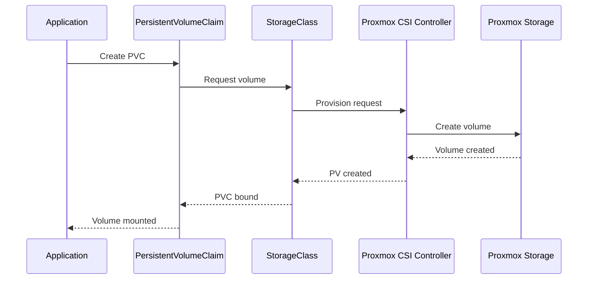

### Storage Classes

```yaml
apiVersion: storage.k8s.io/v1
kind: StorageClass
metadata:
  name: proxmox-csi
  annotations:
    storageclass.kubernetes.io/is-default-class: "true"
provisioner: csi.proxmox.sinextra.dev
parameters:
  storage: local-lvm  # Proxmox storage ID
reclaimPolicy: Delete
volumeBindingMode: Immediate
allowVolumeExpansion: true
```

**Features**:
- **Dynamic Provisioning**: Volumes created on-demand
- **Volume Expansion**: Supports PVC resizing
- **Reclaim Policy**: Delete (volumes removed when PVC deleted)
- **Binding Mode**: Immediate (volume created immediately)

### Storage Backend (Proxmox)

```
Proxmox Storage Pools:
├── local-lvm (default)
│   ├── LVM thin pool
│   ├── Fast local storage
│   └── Used for most PVCs
├── local (optional)
│   ├── Directory-based
│   └── Slower but flexible
└── NFS (future)
    ├── Network storage
    └── Shared across nodes
```

## Database Strategies

### Application Databases

#### PostgreSQL (Immich, Paperless)

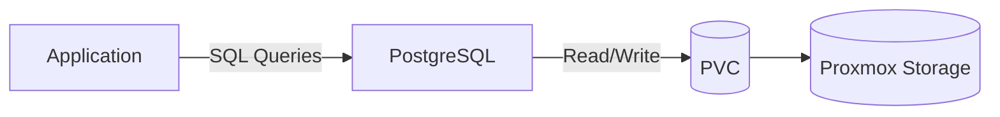

**Configuration**:
- Single instance (no replication)
- Data stored in PVC
- Automatic backups (application-specific)
- Connection pooling via application

**Example PVC**:
```yaml
apiVersion: v1
kind: PersistentVolumeClaim
metadata:
  name: immich-postgres-pvc
  namespace: immich
spec:
  accessModes:
    - ReadWriteOnce
  resources:
    requests:
      storage: 10Gi
  storageClassName: proxmox-csi
```

#### SQLite (Home Assistant, n8n)

- Embedded database (no separate pod)
- Stored in application PVC
- Single-file database
- No network access required

### Kubernetes State (etcd)

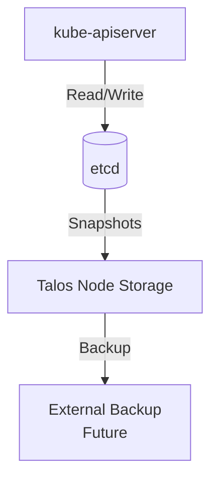

**Characteristics**:
- Managed by Talos Linux
- Automatic snapshots
- Single-node (no HA currently)
- Critical for cluster state

**Snapshot Management**:
```bash
# List snapshots
talosctl -n <control-plane-ip> etcd snapshot ls

# Create manual snapshot
talosctl -n <control-plane-ip> etcd snapshot
```

## Data Lifecycle

### Data Creation

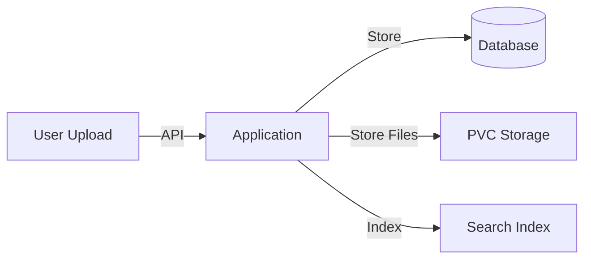

**Example: Photo Upload (Immich)**
1. User uploads photo via web UI
2. Immich API receives file
3. Original stored in PVC (`/mnt/media`)
4. Metadata stored in PostgreSQL
5. Thumbnails generated and stored
6. ML embeddings computed and indexed

### Data Access

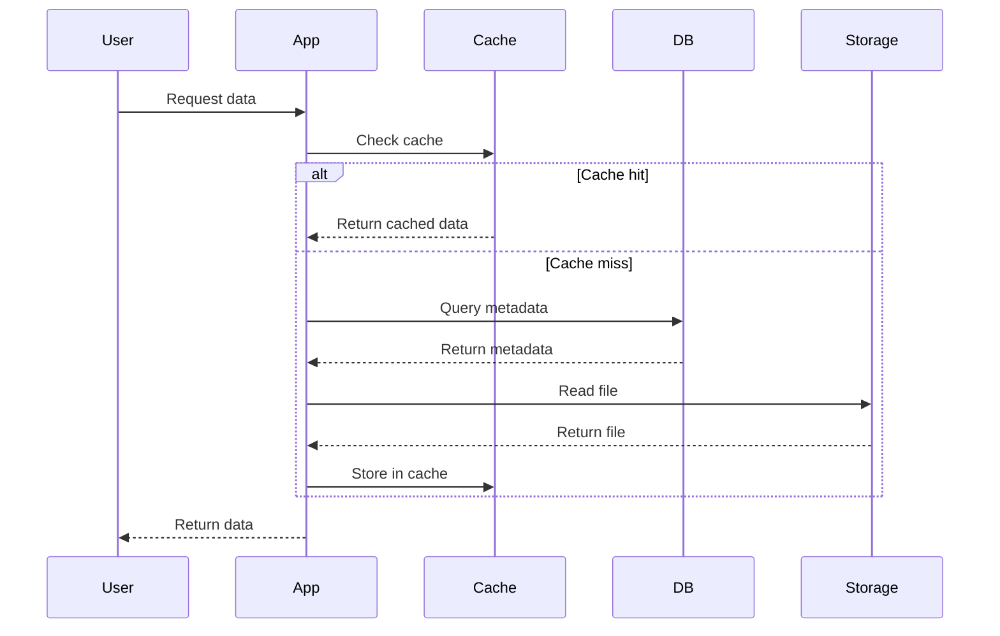

### Data Backup

#### Current State

- **Application-level backups**: Each application responsible for its own backups
- **No centralized backup**: Manual export/import
- **Git for configs**: Infrastructure and configs in version control

#### Backup Strategies by Application

| Application | Backup Method | Frequency | Storage Location |
|-------------|---------------|-----------|------------------|
| Immich | Built-in export | Manual | External drive |
| Paperless | Document export | Manual | External drive |
| Home Assistant | Snapshot | Manual | External drive |
| n8n | Workflow export | Manual | Git repository |
| ArgoCD | Git repository | Continuous | GitHub |
| Secrets | Sealed in Git | Continuous | GitHub |

#### Future: Centralized Backup

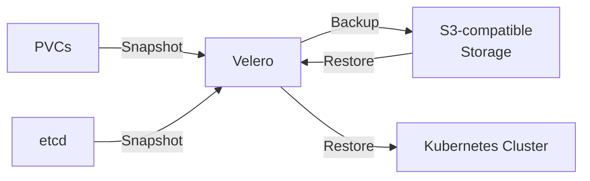

**Planned Tools**:
- **Velero**: Kubernetes backup and restore
- **Restic**: PVC snapshots
- **Proxmox Backup Server**: VM and storage backups
- **Rclone**: Sync to cloud storage (B2, S3)

### Data Retention

| Data Type | Retention Period | Cleanup Method |
|-----------|------------------|----------------|
| Application data | Indefinite | Manual deletion |
| Logs (Loki) | 14 days | Automatic (Grafana Cloud) |
| Metrics (Prometheus) | 30 days | Automatic (Grafana Cloud) |
| etcd snapshots | 7 days | Automatic (Talos) |
| Container images | Until cleanup | Manual via kubectl |

## Data Security

### Encryption at Rest

**Current State**:
- **PVCs**: Not encrypted (depends on Proxmox storage backend)
- **Secrets**: Encrypted in Git (Sealed Secrets)
- **Application data**: Application-specific (e.g., database encryption)

**Future Enhancements**:
- LUKS encryption for Proxmox storage
- etcd encryption at rest
- Application-level encryption for sensitive data

### Encryption in Transit

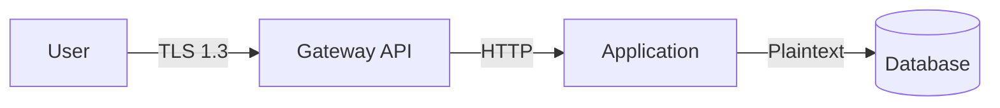

**Current**:
- External traffic: TLS encrypted
- Internal traffic: Plaintext HTTP
- Database connections: Plaintext (local network)

**Future**:
- Service mesh for mTLS between pods
- Encrypted database connections

### Access Control

**Database Access**:
- Credentials stored in Sealed Secrets
- Accessed only by application pods
- No external database access

**Storage Access**:
- PVCs mounted only to specific pods
- No shared filesystem access
- Namespace isolation

## Data Integration Patterns

### External API Integration

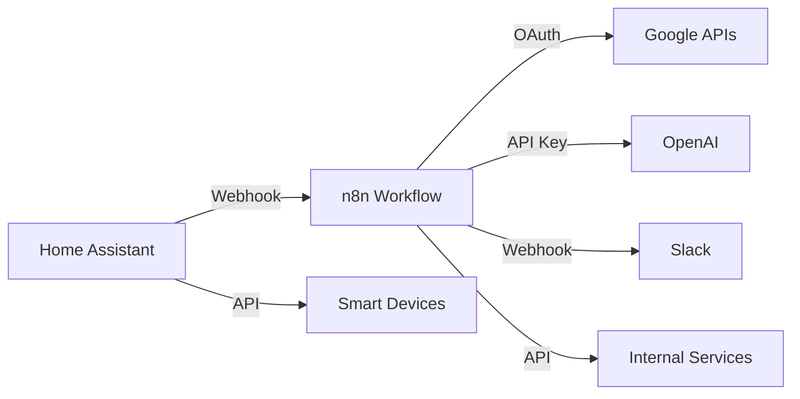

**Authentication Methods**:
- OAuth 2.0 (Google, Microsoft)
- API Keys (stored in Sealed Secrets)
- Webhooks (HTTPS with secrets)
- mTLS (future)

### Inter-Service Communication

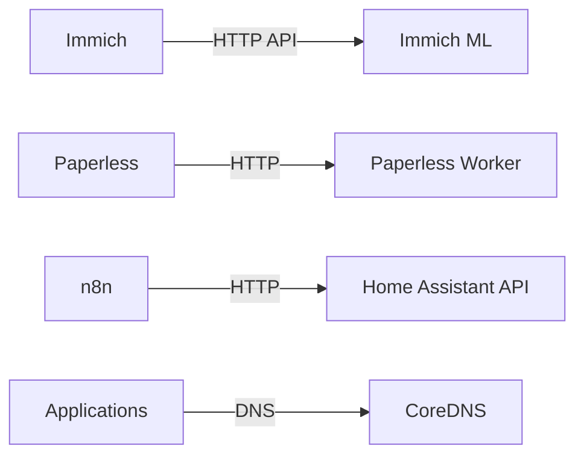

**Service Discovery**:
- Kubernetes DNS (CoreDNS)
- ClusterIP services
- Service naming: `<service>.<namespace>.svc.cluster.local`

## Data Monitoring

### Metrics Collection

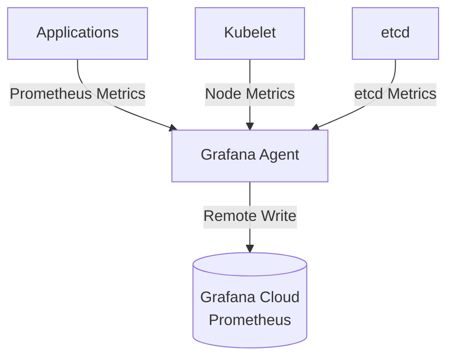

**Metrics Collected**:
- Application metrics (custom)
- Kubernetes metrics (pods, nodes, deployments)
- Infrastructure metrics (CPU, memory, disk, network)
- Database metrics (connections, queries, performance)

### Logs Collection

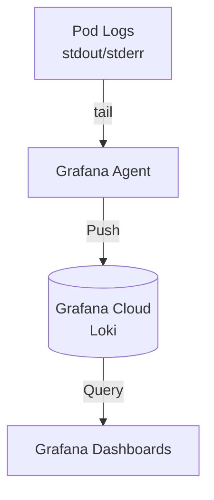

**Log Sources**:
- Container stdout/stderr
- Application logs
- Kubernetes events
- Audit logs (future)

### Data Observability

**Key Metrics to Monitor**:
- Storage utilization (PVC usage)
- Database performance (query latency, connection pool)
- Backup success/failure rates
- Data growth rates
- API latency

## Disaster Recovery

### Data Recovery Scenarios

#### Scenario 1: Application Data Loss

**Recovery Steps**:
1. Restore from application backup
2. Recreate PVC and restore data
3. Redeploy application via ArgoCD
4. Verify data integrity

#### Scenario 2: Complete Cluster Loss

**Recovery Steps**:
1. Rebuild cluster via `make bootstrap`
2. ArgoCD syncs all applications
3. Restore application data from backups
4. Verify all services operational

#### Scenario 3: Database Corruption

**Recovery Steps**:
1. Stop application pod
2. Restore database from backup
3. Restart application
4. Verify data consistency

### Backup Testing

**Quarterly Tasks**:
- Test database restore procedures
- Verify backup integrity
- Practice disaster recovery scenarios
- Update recovery runbooks

## Data Governance

### Data Classification

| Classification | Examples | Security Requirements |
|----------------|----------|----------------------|
| Public | Website content | TLS in transit |
| Internal | Application configs | Sealed Secrets, access control |
| Sensitive | User photos, documents | Encryption at rest (future), strict access control |
| Credentials | Passwords, API keys | Sealed Secrets, never in Git plaintext |

### Data Privacy

**Personal Data**:
- User photos (Immich)
- Scanned documents (Paperless)
- Home automation data (Home Assistant)

**Privacy Measures**:
- Self-hosted (no third-party access)
- No analytics or telemetry
- Local-first architecture
- Encrypted backups

## Performance Optimization

### Caching Strategies

**Redis Caching** (Immich):
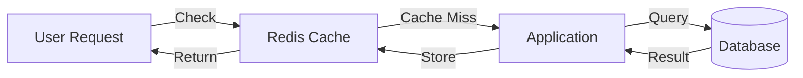

### Database Optimization

**Best Practices**:
- Proper indexing on frequently queried fields
- Connection pooling to limit concurrent connections
- Regular VACUUM for PostgreSQL
- Query optimization
- Monitor slow queries

### Storage Optimization

**Strategies**:
- Image compression (Immich)
- Document deduplication (Paperless)
- Log rotation and cleanup
- Unused PVC cleanup

## Related Documents

- [Container Architecture](02-container-architecture.md) - Service architecture
- [Deployment Architecture](04-deployment-architecture.md) - Infrastructure layout
- [Security Architecture](05-security-architecture.md) - Data security
- [Bootstrap Runbook](../runbooks/bootstrap.md) - Initial setup
